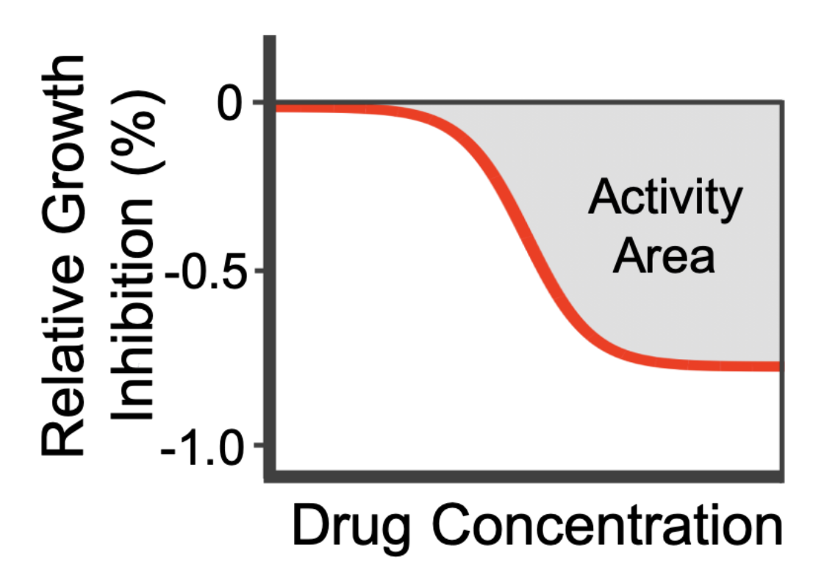
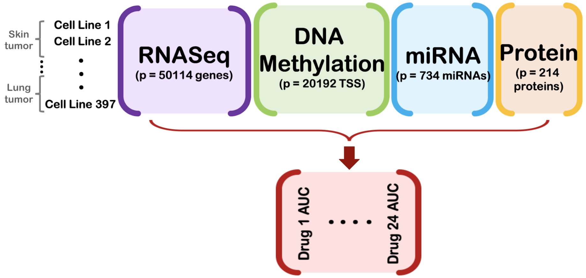

```{r setup, echo = FALSE, message=FALSE, warning=FALSE}
knitr::opts_chunk$set(
  echo = TRUE,
  warning = FALSE,
  message = FALSE,
  cache = TRUE,
  fig.align = "center",
  fig.pos = "H",
  fig.show = "hold"
)

# load in packages
library(tidyverse)
library(tidyimpute)
library(R.utils)
library(knitr)
library(kableExtra)
library(glmnet)
library(HDCI)
library(randomForest)
library(ranger)
library(iRF)
library(caret)
library(gridExtra)
library(ggridges)
library(KRLS)
library(parallel)
library(doParallel)
library(VennDiagram)
library(png)

# load in all utility functions from folder
for (fname in list.files("functions", full.names = T)) {
  source(fname, chdir = T)
}
source("bmtmkl/wpc_index.R")

options(knitr.kable.NA = '--')

# path to save results to 
save.path <- "results/var_filtered/"

# rmarkdown helper function
subchunkify <- function(g, i, fig_height = 12, fig_width = 10, caption = "''") {
  ####### Function Description ########
  # function to allow for multiple plots of different sizes and captions
  # within a single R code chunk
  #
  # code adapted from http://michaeljw.com/blog/post/subchunkify/
  # 
  # inputs:
  # - g = plot
  # - i = chunk id (should be unique for each plot)
  # - fig_height = height of figure
  # - fig_width = width of figure
  # - caption = figure caption; should be within surrounded by two sets of
  #     quotes, e.g., "'This is a valid caption.'"
  ####### 
  
  g_deparsed <- paste0(deparse(function() {g}), collapse = '')
  
  sub_chunk <- paste0(
    "```{r sub_chunk_", i, 
    ", fig.height=", fig_height, ", fig.width=", fig_width, 
    ", fig.cap=", caption,", echo=FALSE, message=FALSE, warning=FALSE}",
    "\n(", g_deparsed, ")()",
    "\n```"
  )
  
  cat(knitr::knit(text = knitr::knit_expand(text = sub_chunk), quiet = TRUE))
}

```

<!-- # Domain problem formulation {#sec:domain} -->
# Domain problem formulation

A central goal in precision medicine is to predict a patient's response to therapeutic drugs given the patient's unique molecular profile [@rubin2015health; @kohane2015ten]. Due to the extremely high costs of many drugs, being able to accurately predict a patient's response to drugs given their molecular profiles is essential for increasing both the health and financial well-being of patients. In this work, we will predict drug responses based on a combination of genomic, proteomic, and epigenomic profiles measured in human cancer cell lines from the Cancer Cell Line Encyclopedia [@barretina2012cancer]. Moving beyond prediction however, a perhaps even more important goal is to identify the -omic features, in particular genes and proteins, that are important in the drug response prediction models. Identifying these -omic signatures is an initial step towards interpreting and understanding the features that drive the drug response prediction methods and may hint at candidates for future preclinical research.

In this PCS documentation for our stability-driven pipeline for drug response interpretable prediction (staDRIP), we will present our analysis from data exploration to modeling to post-hoc analysis, justifying our human judgment calls whenever possible. Through this, we aim to increase transparency and bridge the gap between the biological domain problem and the applied statistical methods. All code to reproduce this work and report can be found on GitHub [here](https://github.com/Yu-Group/staDRIP).

<!-- # Data {#sec:data} -->
# Data

```{r load-and-clean-data, eval = F}

# load in ccle data sets
drug.resp.orig <- loadDrugResp()
mirna.orig <- loadMiRNA()
rnaseq.orig <- loadRNASeq()
methyl.orig <- loadMethyl()
prot.orig <- loadProtein()

# clean ccle data sets
drug.resp <- cleanDrugResp(data = drug.resp.orig)
mirna <- cleanMiRNA(data = mirna.orig)
rnaseq <- cleanRNASeq(data = rnaseq.orig)
methyl <- cleanMethyl(data = methyl.orig)
prot <- cleanProtein(data = prot.orig)

# convert rowname to column for merging
drug.resp.id <- drug.resp %>% rownames_to_column(var = "ID")
mirna.id <- mirna %>% rownames_to_column(var = "ID")
rnaseq.id <- rnaseq %>% rownames_to_column(var = "ID")
methyl.id <- methyl %>% rownames_to_column(var = "ID")
prot.id <- prot %>% rownames_to_column(var = "ID")

# merge entries with data in all four data sets and response data
all.data <- drug.resp.id %>%
  inner_join(x = ., y = mirna.id, by = "ID") %>%
  inner_join(x = ., y = rnaseq.id, by = "ID") %>%
  inner_join(x = ., y = methyl.id, by = "ID") %>%
  inner_join(x = ., y = prot.id, by = "ID") %>%
  column_to_rownames("ID")
saveRDS(all.data, "data/ccle_data_integrated_unfiltered.rds")
  
```

In line with our goals of better understanding patient's responses to drugs given their molecular profiles, the Cancer Cell Line Encyclopedia (CCLE) project is one of the most comprehensive public databases for developing detailed genetic and pharmacologic characterizations of human cancer cell lines  [@costello2014]. In particular, the CCLE generated large-scale genomic, epigenomic, and proteomic data - namely, 1) miRNA expression (734 miRNAs), 2) gene expression measured via RNASeq (50114 transcripts), 3) methylation (20192 regions around transcription start sites), and 4) protein expression (214 proteins) - for $397$ human cancer cell lines, together with pharmacological profiling of $24$ chemotherapy and target therapy drugs. These cell lines come from $23$ different tumor/tissue types. In Figure \@ref(tab:all-tissues), we provide a full list of tumor types and the number of cell lines from each tumor type, and in Table \@ref(tab:profiling-tech), we briefly describe the technologies used to generate the high-throughput data for each molecular profile of interest. This data can be downloaded from DepMap Public 18Q3 (https://depmap.org/portal/download/).

```{r profiling-tech, echo = F, results = "asis"}

tech.df <- data.frame(Profile = c("RNASeq", "Methylation", "miRNA", "Protein"),
                      Description = c("generated with Illumina protocol (TrueSeq) and sequencing machine (either HiSeq 2000 or HiSeq 2500) to profile mRNA",
                                      "generated from reduced representation bisulfite sequencing (RRBS sequencing)",
                                      "pre-selected miRNAs were profiled with NanoString platform",
                                      "generated with reverse phase protein array (RPPA)"))

myKable(tech.df, align = "l", caption = "Description of molecular profiling technologies used to obtain CCLE data")

```

In addition to the molecular profiling data, the CCLE project incorporated a systematic framework to measure molecular correlates of pharmacological sensitivity in vitro. Specifically, for each cell line-drug combination, two groups of cancer cells are cultured across eight different dosages --- one group (the treatment group) is treated with drug at the given dose while the other group (the control group) is treated with blank culture medium. After 72 to 84 hours, assays were used to calculate the percent of growth inhibition by the drug-treated group relative to the control. A very potent drug can inhibit cancer cell growth with very low dose, and an ineffective drug may never reach certain percentage of grow inhibition (i.e. 50%) even with a much higher dose. 

This dose-response data was then taken and fitted to one of three models - a constant model, a logistic (sigmoid) model, or a non-parametric spline interpolation (note that this last model represents less than 5% of models). Using a Chi-squared test, the best model for the dose-response curve was selected, and the area between the response curve and $0$ (i.e., the no response reference level) was defined to be the *activity area*, or AUC (see Figure \@ref(fig:auc)). This AUC is measured on an 8-point scale with 0 corresponding to an inactive compound and 8 corresponding to a compound with $100\%$ inhibition at all 8 dosages. The AUC is a well-accepted measure of drug sensitivity [@jang2014systematic; @barretina2012cancer] and will be the primary response of interest in this work.

```{r auc, echo = F, fig.cap = "Illustration of the activity area (AUC) definition for the drug-response curve.", fig.align = "center", out.width = "40%"}



```

In Figure \@ref(fig:data), we provide a graphical summary of the raw molecular and pharmacological profiling data sets, obtained from the CCLE.

```{r data, echo = F, fig.cap = "Graphical overview of the raw CCLE moolecular profiling data, which are used to predict the drug responses of 24 therapeutic drugs, as measured via the drug response AUC", out.width = "80%"}



```

<div align="center">
```{r all-tissues, echo = F, fig.align = "center", fig.cap = "Frequency of cell lines from each tumor type"}

# load in merged original data
all.data <- readRDS("./data/ccle_data_integrated_unfiltered.rds")

# find tissue types for all data
all.cell.lines <- rownames(all.data)
all.tissue <- str_split(all.cell.lines, pattern = "_", 
                        n = 2, simplify = T)[, 2] %>%
  as.factor()

tissue.df <- table(all.tissue) %>%
  as.data.frame() %>%
  arrange(-Freq) %>%
  rename(`Tumor Type` = all.tissue,
         Frequency = Freq) %>%
  mutate(Frequency = as.character(Frequency))

# print table of tissue frequencies
myKable(tissue.df, full_width = F,
        # scroll = T, scroll_height = "300px", fixed_thead = T,
        caption = "Frequency of cell lines from each tumor type") %>%
  kable_styling(font_size = 12)
# myDT(tissue.df)

```
</div>


<!-- ## Data cleaning and preprocessing {#sec:datacleaning} -->
## Data cleaning and preprocessing

Given the raw data described above, there are a couple areas of initial concern that warrant preprocessing. First, the cancer cell lines encompass 23 different tumor sites with varying frequencies (see Table \@ref(tab:profiling-tech)), and cell lines from the same tumor site tend to have more similar expression profiles than cell lines from different sites. To illustrate, we observe clusters of cell lines by tumor site when performing both hierarchical clustering and PCA on the RNASeq profile in Figure \@ref(fig:viz-tissue). Here, since there are 23 different tissues, we highlight only the five most prominent tissue groups (orange = central nervous system, blue = haematopoietic and lymphoid tissue, green = large intestine, pink = pancreas, brown = skin) and color the other 18 tissues in grey to avoid cluttering. The other molecular profiles (i.e. miRNA, methylation, and protein) exhibit a similar phenomenon, which is to say that the tumor type explains the most variation and is the most dominant (unsupervised) pattern in each profile.

```{r viz-tissue, fig.cap = "(Left) Hierarchical clustering with Ward's linkage and (Right) PCA to the (log-transformed) RNASeq data set, colored by tumor site", fig.width = 9, fig.height = 5, out.width = "50%", echo = F, results = "asis"}

# get the tissue types with most visible clusters (found after exploration)
top.tissues <- table(all.tissue) %>% 
  as.data.frame() %>%
  filter(all.tissue %in% c("CENTRAL_NERVOUS_SYSTEM",
                           "HAEMATOPOIETIC_AND_LYMPHOID_TISSUE",
                           "LARGE_INTESTINE",
                           "SKIN", "PANCREAS")) %>%
  pull(all.tissue) %>%
  droplevels()

# for plotting purposes later (to color tissues by type)
tissue.col <- all.tissue
levels(tissue.col)[!(levels(tissue.col) %in% top.tissues)] <- "Other"

# choose color scheme: grey, orange, blue, green, magenta, brown
mycolor <- c("grey", "#FF7F00", "#56B4E9", "#009E73", "magenta", "#5F2A00")

# get rnaseq data
rnaseq <- all.data[, str_detect(colnames(all.data), "ENSG")]

# perform hierarchical clustering on rnaseq data
rnaseq.hclust <- plotHclust(data = log(rnaseq + 1), y = tissue.col, 
                            show.y.text = F, linkage = "ward.D", 
                            text.size = 1, manual.color = mycolor, 
                            title = "Hierarchical Clustering on RNASeq Profile")
plot(rnaseq.hclust$dend, main = "Hierarchical Clustering on RNASeq Profile", yaxt = "n")

# perform pca on rnaseq data
rnaseq.pca <- plotPCA(X = log(rnaseq + 1), npcs = 4, color = tissue.col,
                      show.var = T, title = "PCA on RNASeq Profile", alpha = 1,
                      center = T, scale = F, manual.color = mycolor,
                      size_theme = "medium")
rnaseq.pca$plot

```

Due to these inherent differences and variability between tissues, we choose to omit the cell lines from tissues with fewer than 8 cell lines (i.e. the kidney, upper aerodigestive tract, thyroid, pleura, prostate, biliary tract, and salivary gland). This reduces our sample size to $370$ cell lines from $16$ tumor sites.

```{r exclude-tissues, eval = F}

# tissues with < 8 cell lines
exclude.tissues <- table(all.tissue) %>% 
  as.data.frame() %>%
  filter(Freq < 8) %>%
  pull(all.tissue) %>%
  droplevels()

# ignore cell lines from tissues with < 8 cell lines
all.data <- all.data[!(all.tissue %in% exclude.tissues), ]
all.tissue <- all.tissue[!(all.tissue %in% exclude.tissues)] %>% droplevels()

```

From these remaining samples, we partition the data into a training, validation, and test set using a 50-25-25\% partitioning scheme, stratified on tumor type. Note that the minimum threshold of $8$ cell lines in each tumor site was chosen to ensure we have at least 2 cell lines from each tumor site in each of the training, validation, and test splits.

```{r split-data, eval = F}

# splitting proportions; can change as needed
test.prop <- 1/4
valid.prop <- 1/4
train.prop <- 1 - test.prop - valid.prop

# stratified split data into training, validation, and test based upon 
set.seed(100)
data.split <- data.frame(tissue = all.tissue) %>%
  group_by(tissue) %>%
  mutate(split.idx = sample(c(rep("train", ceiling(train.prop * n())),
                              rep("valid", ceiling(valid.prop * n())),
                              rep("test", ceiling(test.prop * n()))),
                            size = n(), replace = F)) %>%
  ungroup()

# list of three: train, valid, test
data.split <- split(all.data, data.split$split.idx) 

# split merged data back into response, mirna, rnaseq, methyl, and prot
data.split.ls <- lapply(
  data.split, 
  FUN = function(X) {
    df.idx <- c(rep("drug.resp", times = ncol(drug.resp)),
                rep("mirna", times = ncol(mirna)),
                rep("rnaseq", times = ncol(rnaseq)),
                rep("methyl", times = ncol(methyl)),
                rep("prot", times = ncol(prot)))
    
    X <- X %>%
      t() %>% as.data.frame() %>% # transpose data.frame
      split(., df.idx) %>% # split df into response, mirna, rnaseq, methyl, prot
      lapply(FUN = function(x) {return(as.data.frame(t(x)))}) # transpose back
    
    return(X)
  })

# save data split
saveRDS(data.split.ls$train, "./data/train.rds")
saveRDS(data.split.ls$valid, "./data/valid.rds")
saveRDS(data.split.ls$test, "./data/test.rds")

```

In addition to reducing the number of samples in our analysis, we also chose to reduce the number of features to manageable sizes before continuing with our analyses. Originally, the CCLE data consisted of 734 miRNAs, 50114 genes, 20192 transcription start sites (TSS), and 214 antibodies. Given the incredibly large number of features in the RNASeq and methylation data sets, we aggressively preprocessed the number of genes and TSS to manageable sizes by taking the top $10\%$ of genes (or 5000 genes) and top $20\%$ of TSS (or 4000 TSS) with the highest variance. We also transformed the miRNA and RNASeq expression values using the log-transformation $\log(x+1)$ in order to mitigate problems with highly skewed positive count values.

```{r preprocess-data}
 
# read in pre-processed training, validation, and test sets -------------------
train <- readRDS("./data/train.rds")
valid <- readRDS("./data/valid.rds")
test <- readRDS("./data/test.rds")

# training data ---------------------------------------------------------------
drug.resp <- train$drug_resp
mirna <- train$mirna
rnaseq <- train$rnaseq
methyl <- train$methyl
prot <- train$prot

# helper variables
nvalid <- nrow(valid$drug_resp)
ntest <- nrow(test$drug_resp)
ndrugs <- ncol(drug.resp)
types <- c("mirna", "rnaseq", "methyl", "prot") # data types

# remove columns in rnaseq with no variance
rnaseq <- rnaseq %>%
  select(-which(apply(., 2, var) == 0))

# impute NAs in methylation with the column mean
methyl.imputed <- impute_mean(methyl) %>%
  # remove columns in methyl with no variance
  select(-which(apply(., 2, var, na.rm = T) == 0))

# get tissue type for each cell line
cell.lines <- rownames(drug.resp)
tissue <- str_split(cell.lines, pattern = "_", n = 2, simplify = T)[, 2] %>%
  as.factor()

# validation data -------------------------------------------------------------
mirna.valid <- valid$mirna
rnaseq.valid <- valid$rnaseq[, colnames(rnaseq)]
methyl.valid <- valid$methyl[, colnames(methyl.imputed)] %>%
  replace_na(data = ., replace = as.list(colMeans(methyl.imputed)))
prot.valid <- valid$prot
resp.valid <- valid$drug_resp

# get tissue type for each cell line in validation set
cell.lines.valid <- rownames(resp.valid)
tissue.valid <- str_split(cell.lines.valid,
  pattern = "_",
  n = 2, simplify = T
)[, 2] %>%
  as.factor()

# test data -------------------------------------------------------------
mirna.test <- test$mirna
rnaseq.test <- test$rnaseq[, colnames(rnaseq)]
methyl.test <- test$methyl[, colnames(methyl.imputed)] %>%
  replace_na(data = ., replace = as.list(colMeans(methyl.imputed)))
prot.test <- test$prot
resp.test <- test$drug_resp

# filter features -------------------------------------------------------------
rnaseq.filt <- filterByVar(dat = rnaseq, max.p = 5000)
methyl.filt <- filterByVar(dat = methyl.imputed, max.p = 4000)
rnaseq.valid.filt <- rnaseq.valid[, colnames(rnaseq.filt)]
methyl.valid.filt <- methyl.valid[, colnames(methyl.filt)]
rnaseq.test.filt <- rnaseq.test[, colnames(rnaseq.filt)]
methyl.test.filt <- methyl.test[, colnames(methyl.filt)]

# put cleaned/filtered training data in list ----------------------------------
all.data <- list(
  mirna = log(mirna + 1),
  rnaseq = log(rnaseq.filt + 1),
  methyl = methyl.filt,
  prot = prot
)

# put cleaned/filtered validation data in list --------------------------------
all.data.valid <- list(
  mirna = log(mirna.valid + 1),
  rnaseq = log(rnaseq.valid.filt + 1),
  methyl = methyl.valid.filt,
  prot = prot.valid
)

# put cleaned/filtered validation data in list --------------------------------
all.data.test <- list(
  mirna = log(mirna.test + 1),
  rnaseq = log(rnaseq.test.filt + 1),
  methyl = methyl.test.filt,
  prot = prot.test
)

# put cleaned/filtered data in concatenated data matrix -----------------------
concat.data <- do.call(cbind, all.data)
concat.data.valid <- do.call(cbind, all.data.valid)
concat.data.test <- do.call(cbind, all.data.test)

```

We recognize however that there were many other reasonable ways to preprocess this data. For instance, we could have taken the top 20\% of genes and top 40\% of TSS with the highest variance. Another common alternative would have been to filter features using marginal correlations with the response or using a multivariate prediction model (e.g., the Lasso). To assess robustness to these choices, we provide a further investigation into the following alternative preprocessing procedures in the Appendix: 

* Variance-filtering, taking the top $20\%$ of genes and $40\%$ of TSS (i.e., building a model twice as large as the current work)
* Filtering by marginal correlations between the features and drug responses, taking the top $10\%$ of genes and $20\%$ of TSS
* Using the Lasso for filtering and keeping the top $10\%$ of genes and $20\%$ of TSS with the largest coefficients (in magnitude)

Across these different preprocessing procedures, the prediction accuracies are higher using the variance-filtering preprocessing pipelines, as compared to the correlation-filtering and Lasso-filtering pipelines. Further, the smaller variance-filtered model gives similar prediction accuracies as the larger variance-filtered model. Due to the high computational complexity of fitting numerous models (and data-perturbed models) for 24 drugs, we thus choose to focus our attention on the more restrictive variance-filtering procedure, taking the top $10\%$ of genes and $20\%$ of TSS. This procedure is also preferred over the alternatives as it is less computationally expensive than the model with twice as many features, and while marginal correlations and multivariate prediction models such as the Lasso look at the response, variance-filtering avoids any risk of data snooping and over-fitting. Moving forward, we will use and focus primarily on the variance-filtering procedure, taking the top $10\%$ of genes and $20\%$ of TSS.

To summarize, after preprocessing and data cleaning, we arrive at $370$ cell lines with molecular data across the four molecular profiles of interest:

* miRNA (log-transformed): p = `r ncol(mirna)` miRNAs,
* RNASeq (log-transformed): p = `r ncol(rnaseq.filt)` genes,
* Methylation: p = `r ncol(methyl.filt)` transcription start sites (TSS),
* Protein: p = `r ncol(prot)` antibodies,

and pharmacological data (in particular the AUC drug response scores) for 24 compounds. We provide a quick summary of the resulting pre-processed data by plotting the overall distribution of features in the four data sets as well as the distribution of the 24 drug responses in Figure \@ref(fig:dist-feat). 

```{r dist-feat, echo = F, out.width = "100%", fig.height = 8, fig.cap="In the left column, we plot the distribution of the features in each of the four data set. On the right, we show the distribution of the responses for each of the 24 drugs."}

## plot histograms of features

# mirna
mirna.hist <- plotHistogram(data = log(mirna + 1), bins = 20) +
  labs(x = "log(miRNA + 1)", 
       title = "miRNA") +
  theme(plot.margin = unit(c(0, 0, .5, 0), "cm"),
        plot.title = element_text(hjust = 0.5))

# rnaseq
rnaseq.hist <- plotHistogram(data = log(rnaseq + 1), bins = 20) +
  labs(x = "log(RNASeq + 1)", 
       title = "RNASeq") +
  theme(plot.margin = unit(c(0, 0, .5, 0), "cm"),
        plot.title = element_text(hjust = 0.5))

# methylation
methyl.hist <- plotHistogram(data = methyl, bins = 20) +
  labs(x = "Methylation",
       title = "Methylation") +
  theme(plot.margin = unit(c(0, 0, .5, 0), "cm"),
        plot.title = element_text(hjust = 0.5))

# protein
prot.hist <- plotHistogram(data = prot, bins = 20) +
  labs(x = "Protein",
       title = "Protein") +
  theme(plot.margin = unit(c(0, 0, .5, 0), "cm"),
        plot.title = element_text(hjust = 0.5))

## plot distribution of each drug response
drug.resp.long <- gather(data = drug.resp, key = "Drug", value = "AUC")
resp.hist <- ggplot(drug.resp.long) +
  aes(x = AUC, y = Drug, fill = ..x..) +
  geom_density_ridges_gradient(scale = .98) +
  scale_fill_viridis(name = "AUC", option = "C") +
  myGGplotTheme() +
  labs(title = "Distribution of Drug Responses") +
  guides(fill = F)

grid.arrange(resp.hist, mirna.hist, rnaseq.hist, methyl.hist, prot.hist, 
             layout_matrix = matrix(c(2:5, rep(1, 4)), 
                                    byrow = F, ncol = 2),
             widths = c(1, 1.25))

```

<!-- # Prediction formulation {#sec:predform} -->
# Prediction formulation

Before turning to our primary goal of identifying important genes and proteins for drug response prediction, we first use predictive accuracy as a reality check to filter out models that are poor fits for the observed data. 
<!-- That is, we use prediction accuracy as a metric for filtering out poor models, which hold little to no semblance to the observed data.  -->
As in data preprocessing, there are many human judgment calls here in the predictive modeling stage that warrant justification including the profiling data types used for training and the decision of which methods to fit.

## Choosing the molecular profiles

In terms of the molecular profiles used in the fitting, since gene expression is known to be the most predictive profile of drug sensitivity [@costello2014], we choose to first fit predictive methods on each molecular profiling type (i.e., miRNA, RNASeq, methylation, and protein expression profiles) separately and take this non-integrative approach as our baseline. Similar to @costello2014, we will show that the CCLE data follows a similar pattern --- the RNASeq data is the most predictive of drug sensitivity. However, in some cases, predictive performance can increase when training on multiple profiles simultaneously [@costello2014]. Since different types of molecules all interact within the same biological system, an integrative approach that jointly incorporates the miRNA, RNASeq, methylation, and protein data sets may be able to provide a more holistic and perhaps more realistic model of the biological phenomenon at hand. We thus also try various integrative approaches including training on the concatenated molecular profiling data and other existing integrative -omics methods.

## Choosing the prediction models

In the ideal setting, the prediction methods chosen should have some justified connection to the biological problem at hand, but a priori, it is unclear which models or assumptions best fit the biological drug response mechanism. Nonetheless, we have reasons to believe that the Lasso, elastic net, random forest, and kernel ridge regression are particularly appealing fits for this problem. We discuss each of these models, their assumptions, and justifications next.

First, the Lasso assumes a sparse linear model, meaning that the effect of each feature is additive and only a sparse number of the features contribute to the drug sensitivity. The simplicity and interpretability of the Lasso makes it a popular tool for bioinformatics prediction tasks, so we choose to use the Lasso as a baseline model for our analysis. The elastic net is perhaps even more popular than the Lasso in drug response prediction studies [@jang2014systematic; @barretina2012cancer]. Similar to the Lasso, the elastic net assumes linearity and some sparsity but is also able to better handle correlated features.  Beyond linearity, kernel ridge regression with a Gaussian kernel allows for more flexible, but less interpretable, functional relationships that are not necessarily linear. Kernel methods have been applied in previous case studies with great success [@costello2014] and are hence promising candidates for our study as well. Lastly, random forest can be viewed as a collection of localized, non-linear thresholded decisions rules (like on-off switches), which are well-suited for many biological processes that match the combinatorial thresholding (or switch-like) behavior of decision trees [@nelson2008lehninger]. Random forests are also invariant to the scale of the data. This is especially advantageous for integrating different data sets with varying scales and domain types (e.g., count-valued RNASeq expression, proportion-valued methylation data, continuous-valued protein expression).

Note that though an alternative approach would have been to develop new methodology, we instead leverage these existing machine learning methods that have been rigorously vetted and have been shown to work well in many related problems.

## Prediction evaluation metrics

To measure the accuracy of the models, we consider many different metrics as each captures a different aspect of prediction and has advantages and disadvantages:

1. **Mean-squared Error** ($MSE$) = the mean sum of squared errors between the predicted responses and the observed responses. This is the most widely used prediction metric in machine learning but can be volatile due to outliers.
2. **R-squared** ($R^2$) = $1 - \frac{\text{MSE}(Y, \hat{Y})}{\text{Var}(Y)}$, where $\text{Var}(Y)$ denotes the variance of the observed responses, and $\text{MSE}(Y, \hat{Y})$ denotes the mean sum of squared errors between the predicted responses $\hat{Y}$ and observed responses $Y$. $R^2$ is a rescaling of the MSE that accounts for the amount of variation in the observed response and thus allows us to more easily compare accuracies between drug response models with different amounts of variation in the observed response, but as with the MSE, $R^2$ can be heavily influenced by outliers. 
3. **Correlation** = the (Pearson) correlation between the predicted responses and the observed responses. The correlation metric is scale-invariant and thus conveniently enables direct comparisons between models for different drugs.
4. **Probabilistic concordance-index (*PC*-index)** = a measure of how well the predicted rankings agree with the true responses. This metric, like the correlation metric, takes into account the variance of the drug responses, $y$, but it also assumes that the drug responses follow a Gaussian distribution, which may not be true in some cases. We consider this metric because it is the primary method of evaluation in @costello2014. Given the large scale and breadth of the NCI-DREAM challenge in @costello2014, we will compare our results to this work. We refer to @costello2014 for details on the exact computation of the PC-index.

In each of the proposed evaluation metrics above, we receive a score for each of the 24 drug response models. It may also be beneficial to aggregate the 24 scores into a single number for concrete evaluation. In particular, @costello2014 used a weighted average of the *PC*-indices to compare various models and referred to this evaluation metric as the *weighted PC-index* (*WPC*-index). To compare our results with those in @costello2014, we also consider the *WPC*-index in evaluating our models.

<!-- # Stability formulation {#sec:stability_form} -->
# Stability formulation

Beyond predictability checks, we emphasize the importance of stability throughout the data science life cycle so as to reduce reliance on particular human judgment calls. In particular, our primary goal is to identify the genes and proteins which are predictive of drug sensitivity, and stability serves as a minimum requirement in this scientific knowledge discovery. Ultimately, successfully identifying these -omic features that are stable and predictive of drug sensitivity is a first step towards a more reliable scientific recommendation system for preclinical research. This has important practical implications, especially given the reliance and success of hypothesis-driven studies in previous cancer research.

With this goal of reliable interpretability in mind, we leverage the stability principle and quantify the stability of important features under numerous data and model perturbations. Here, we say an -omic feature is *stable* if it is stable across both data-perturbed bootstrap samples and across multiple models with similarly high predictive power. That is, if a particular feature is frequently selected or deemed important even when slightly perturbing the data via bootstrap samples and when using different models, then we say that the feature is *stable*. This stability across data perturbations and models gives us evidence to believe that the feature is associated with the desired response (in this case, the drug sensitivity measured via AUC). 

<!-- # Model Fitting & Prediction Analysis {#sec:models} -->
# Model Fitting & Prediction Analysis

## Non-integrative fits {.tabset .tabset-pills .tabset-fade}
For each of the 24 drugs, we begin by fitting the Lasso, elastic net (with $\alpha = 0.5$), kernel ridge regression (with a Gaussian kernel), and RF to each molecular profiling data set separately as a baseline measure. To select hyperparameters in each method, we use 5-fold cross validation, where the folds are stratified by tissue type. We also investigate using the estimation stability cross validation (ESCV) metric for selecting the Lasso's hyperparameter as this metric combines a stability measure within the cross-validation framework to yield more stable estimation properties with minimal loss of accuracy [@lim2016estimation].

```{r helper-vars}

# setting hyperparameters
nfolds <- 5
ntree <- 500
mtrys <- list(
  mirna = seq(150, 350, by = 50),
  rnaseq = seq(1000, 2000, by = 250),
  methyl = seq(1000, 2000, by = 250),
  prot = seq(50, 90, by = 10)
)

```

```{r nonintegrative-fits, eval = F}

# fit non-integrative models for each of the 24 drugs
registerDoParallel(cores = 24)
for (type in types) {
  
  out <- foreach(drug = 1:ndrugs, 
                 .packages = c("glmnet", "KRLS", "caret")) %dopar% {
    
    Xtrain <- as.matrix(all.data[[type]])
    Xvalid <- as.matrix(all.data.valid[[type]])
    
    # remove data with missing responses
    missing.idx <- which(is.na(drug.resp[, drug]))
    if (length(missing.idx) >= 1) {
      Xtrain <- Xtrain[-missing.idx, ]
      y <- drug.resp[-missing.idx, drug]
      tissue.type <- tissue[-missing.idx]
    } else {
      y <- drug.resp[, drug]
      tissue.type <- tissue
    }
    
    # stratified cv folds
    foldid <- data.frame(tissue = tissue.type) %>%
      group_by(tissue) %>%
      mutate(split.idx = sample(rep(1:nfolds, each = ceiling(n() / nfolds)),
                                size = n(), replace = F)) %>%
      pull(split.idx)
    
    # fit lasso+cv
    lasso.fit <- cv.glmnet(x = Xtrain, y = y, 
                           nfolds = nfolds, alpha = 1, foldid = foldid)
    
    # fit lasso+escv
    lambda.escv <- escv.glmnet(x = Xtrain, y = y, nfolds = nfolds, 
                               lambda = seq(0, 0.2, 0.002),
                               alpha = 1, foldid = foldid)$lambda.escv
    lasso.escv.fit <- glmnet(x = Xtrain, y = y, alpha = 1, lambda = lambda.escv)
    
    # fit elastic net+cv
    elnet.fit <- cv.glmnet(x = Xtrain, y = y, 
                           nfolds = nfolds, alpha = .5, foldid = foldid)
    
    # fit kernel
    kernel.fit <- krls(X = Xtrain, y = y, 
                       whichkernel = "gaussian", print.level = 0)
  
    # fit rf
    rf.fit <- caret::train(
      x = Xtrain, y = y, preProcess = NULL, method = "ranger",
      tuneGrid = expand.grid(mtry = mtrys[[type]],
                             splitrule = "variance",
                             min.node.size = c(3, 5)),
      trControl = trainControl(method = "cv",
                               number = nfolds,
                               verboseIter = F,
                               selectionFunction = "best", 
                               index = groupKFold(tissue.type, k = nfolds),
                               allowParallel = F),
      importance = "impurity", num.trees = ntree, num.threads = 1
    )$finalModel
  
    # make predictions
    lasso.pred <- predict(lasso.fit, newx = Xvalid, s = "lambda.min")
    lasso.escv.pred <- predict(lasso.escv.fit, newx = Xvalid)
    elnet.pred <- predict(elnet.fit, newx = Xvalid, s = "lambda.min")
    kernel.pred <- predict(kernel.fit, newdata = Xvalid)$fit
    rf.pred <- predict(rf.fit, Xvalid, num.threads = 1)$predictions
    
    list(lasso.fits = lasso.fit,
         lasso.escv.fits = lasso.escv.fit,
         elnet.fits = elnet.fit,
         kernel.fits = kernel.fit,
         rf.fits = rf.fit,
         lasso.preds = lasso.pred,
         lasso.escv.preds = lasso.escv.pred,
         elnet.preds = elnet.pred,
         kernel.preds = kernel.pred,
         rf.preds = rf.pred)
  }
  
  lasso.fits <- lapply(out, FUN = function(X) {return(X$lasso.fits)})
  lasso.escv.fits <- lapply(out, FUN = function(X) {return(X$lasso.escv.fits)})
  elnet.fits <- lapply(out, FUN = function(X) {return(X$elnet.fits)})
  kernel.fits <- lapply(out, FUN = function(X) {return(X$kernel.fits)})
  rf.fits <- lapply(out, FUN = function(X) {return(X$rf.fits)})
  lasso.preds <- mapply(out, FUN = function(X) {return(X$lasso.preds)})
  lasso.escv.preds <- mapply(out, 
                             FUN = function(X) {return(X$lasso.escv.preds)})
  elnet.preds <- mapply(out, FUN = function(X) {return(X$elnet.preds)})
  kernel.preds <- mapply(out, FUN = function(X) {return(X$kernel.preds)})
  rf.preds <- mapply(out, FUN = function(X) {return(X$rf.preds)})
  
  indiv.preds.ls <- list(Lasso = lasso.preds,
                         `Lasso (ESCV)` = lasso.escv.preds,
                         `Elastic Net` = elnet.preds,
                         Kernel = kernel.preds,
                         RF = rf.preds)
  
  # compute mse
  indiv.mse <- mapply(indiv.preds.ls, FUN = function(preds) {
    return(colMeans((preds - resp.valid)^2, na.rm = T))
  }) %>% t()
  
  # compute correlation
  indiv.corr <- mapply(indiv.preds.ls, FUN = function(preds) {
    return(diag(cor(x = preds, y = resp.valid, use = "pairwise.complete.obs")))
  }) %>% t()
  
  # compute pc metric
  pc.null <- pc.nulldist(resp.valid)
  indiv.pc <- mapply(indiv.preds.ls, FUN = function(preds) {
    return(pcs(preds, resp.valid, pc.null))
  }) %>% t()
  
  # compute wpc metric
  indiv.wpc <- mapply(indiv.preds.ls, FUN = function(preds) {
    return(wpc(preds, resp.valid, pc.null))
  })
  
  saveRDS(indiv.mse, paste0(save.path, type, "_mse.rds"))
  saveRDS(indiv.corr, paste0(save.path, type, "_corr.rds"))
  saveRDS(indiv.pc, paste0(save.path, type, "_pc.rds"))
  saveRDS(indiv.wpc, paste0(save.path, type, "_wpc.rds"))
  saveRDS(lasso.fits, paste0(save.path, type, "_lasso_fits.rds"))
  saveRDS(lasso.escv.fits, paste0(save.path, type, "_lasso_escv_fits.rds"))
  saveRDS(elnet.fits, paste0(save.path, type, "_elnet_fits.rds"))
  saveRDS(kernel.fits, paste0(save.path, type, "_kernel_fits.rds"))
  saveRDS(rf.fits, paste0(save.path, type, "_rf_fits.rds"))
}

```

```{r nonintegrative-fits-boot, eval = F, echo = F}

# run individual models for multiple bootstrap samples
n.boot <- 100
registerDoParallel(cores = 32)
types <- c("prot", "mirna", "methyl", "rnaseq")

for (type in types) {
  
  boot.out <- foreach(boot = 1:n.boot, 
                      .packages = c("glmnet", "KRLS", "caret")) %dopar% {
                        
    # initialize parameters
    lasso.lams <- rep(NA, ndrugs)
    lasso.betas <- list()
    lasso.pred.bs <- list()
    lasso.pred.oob <- list()
    lasso.escv.lams <- rep(NA, ndrugs)
    lasso.escv.betas <- list()
    lasso.escv.pred.bs <- list()
    lasso.escv.pred.oob <- list()
    elnet.lams <- rep(NA, ndrugs)
    elnet.betas <- list()
    elnet.pred.bs <- list()
    elnet.pred.oob <- list()
    kernel.pred.bs <- list()
    kernel.pred.oob <- list()
    rf.imps <- list()
    rf.pred.bs <- list()
    rf.pred.oob <- list()
    bs.idxs <- list()
    
    for (drug in 1:ndrugs) {
      Xtrain <- as.matrix(all.data[[type]])
      Xvalid <- as.matrix(all.data.valid[[type]])
      
      # remove data with missing responses
      missing.idx <- which(is.na(drug.resp[, drug]))
      if (length(missing.idx) >= 1) {
        Xtrain <- Xtrain[-missing.idx, ]
        y <- drug.resp[-missing.idx, drug]
        tissue.type <- tissue[-missing.idx]
      } else {
        y <- drug.resp[, drug]
        tissue.type <- tissue
      }
      
      # get bootstrap sample
      bs.idx <- sample(1:nrow(Xtrain), nrow(Xtrain), replace = T)
      bs.idxs[[drug]] <- bs.idx
      Xtrain.bs <- Xtrain[bs.idx, ]
      Xtrain.oob <- Xtrain[-bs.idx, ]
      y.bs <- y[bs.idx]
      y.oob <- y[-bs.idx]
      tissue.type.bs <- tissue.type[bs.idx]
      
      # stratified cv folds
      foldid.bs <- data.frame(tissue = tissue.type.bs) %>%
        group_by(tissue) %>%
        mutate(split.idx = sample(rep(1:nfolds, each = ceiling(n() / nfolds)),
                                  size = n(), replace = F)) %>%
        pull(split.idx)
      
      if (sum(apply(Xtrain.bs, 2, var) == 0) == 0) {
        # fit lasso
        lasso.fit.bs <- cv.glmnet(x = Xtrain.bs, y = y.bs, 
                                  nfolds = nfolds, alpha = 1,
                                  foldid = foldid.bs)
        best.lam.idx <- which(lasso.fit.bs$glmnet.fit$lambda ==
                                lasso.fit.bs$lambda.min)
        lasso.lams[drug] <- lasso.fit.bs$lambda.min
        lasso.betas[[drug]] <- lasso.fit.bs$glmnet.fit$beta[, best.lam.idx]
        
        # fit lasso (escv)
        lambda.escv <- escv.glmnet(x = Xtrain.bs, y = y.bs, nfolds = nfolds, 
                                   lambda = seq(0, 0.2, 0.002),
                                   alpha = 1, foldid = foldid.bs)$lambda.escv
        lasso.escv.fit.bs <- glmnet(x = Xtrain.bs, y = y.bs, alpha = 1, 
                                    lambda = lambda.escv)
        lasso.escv.lams[drug] <- lambda.escv
        lasso.escv.betas[[drug]] <- lasso.escv.fit.bs$beta[, 1]
        
        # fit elastic net
        elnet.fit.bs <- cv.glmnet(x = Xtrain.bs, y = y.bs, 
                                  nfolds = nfolds, alpha = 0.5,
                                  foldid = foldid.bs)
        best.lam.idx <- which(elnet.fit.bs$glmnet.fit$lambda ==
                                elnet.fit.bs$lambda.min)
        elnet.lams[drug] <- elnet.fit.bs$lambda.min
        elnet.betas[[drug]] <- elnet.fit.bs$glmnet.fit$beta[, best.lam.idx]
        
        # fit kernel
        kernel.fit.bs <- krls(X = Xtrain.bs, y = y.bs, 
                              whichkernel = "gaussian", print.level = 0)
        
        # fit rf (with pre-tuned parameters)
        rf.df <- data.frame(y = y.bs, Xtrain.bs)
        rf.fit <- readRDS(paste0(save.path, type, "_rf_fits.rds"))[[drug]]
        rf.fit.bs <- ranger(y ~., data = rf.df, 
                            num.trees = ntree, importance = "impurity",
                            min.node.size = rf.fit$tuneValue$min.node.size, 
                            splitrule = rf.fit$tuneValue$splitrule,
                            mtry = rf.fit$tuneValue$mtry,
                            num.threads = 1)
        rf.imps[[drug]] <- rf.fit.bs$variable.importance
        
        # make predictions on validation and oob sets
        lasso.pred.bs[[drug]] <- predict(lasso.fit.bs, newx = Xvalid,
                                         s = "lambda.min")
        lasso.pred.oob[[drug]] <- predict(lasso.fit.bs, newx = Xtrain.oob, 
                                          s = "lambda.min")
        lasso.escv.pred.bs[[drug]] <- predict(lasso.escv.fit.bs, 
                                              newx = Xvalid)
        lasso.escv.pred.oob[[drug]] <- predict(lasso.escv.fit.bs, 
                                               newx = Xtrain.oob)
        elnet.pred.bs[[drug]] <- predict(elnet.fit.bs, newx = Xvalid,
                                         s = "lambda.min")
        elnet.pred.oob[[drug]] <- predict(elnet.fit.bs, newx = Xtrain.oob, 
                                          s = "lambda.min")
        kernel.pred.bs[[drug]] <- predict(kernel.fit.bs,
                                          newdata = Xvalid)$fit
        kernel.pred.oob[[drug]] <- predict(kernel.fit.bs, 
                                           newdata = Xtrain.oob)$fit
        rf.pred.bs[[drug]] <- predict(rf.fit.bs, 
                                      data.frame(Xvalid),
                                      num.threads = 1)$predictions
        rf.pred.oob[[drug]] <- predict(rf.fit.bs,
                                       data.frame(Xtrain.oob),
                                       num.threads = 1)$predictions
      } else {  # at least one column is constant; run err
        lasso.lams[drug] <- NA
        lasso.betas[[drug]] <- rep(NA, ncol(Xtrain))
        lasso.pred.bs[[drug]] <- rep(NA, nrow(Xvalid))
        lasso.pred.oob[[drug]] <- rep(NA, nrow(Xtrain.oob))
        lasso.escv.lams[drug] <- NA
        lasso.escv.betas[[drug]] <- rep(NA, ncol(Xtrain))
        lasso.escv.pred.bs[[drug]] <- rep(NA, nrow(Xvalid))
        lasso.escv.pred.oob[[drug]] <- rep(NA, nrow(Xtrain.oob))
        elnet.lams[drug] <- NA
        elnet.betas[[drug]] <- rep(NA, ncol(Xtrain))
        elnet.pred.bs[[drug]] <- rep(NA, nrow(Xvalid))
        elnet.pred.oob[[drug]] <- rep(NA, nrow(Xtrain.oob))
        kernel.pred.bs[[drug]] <- rep(NA, nrow(Xvalid))
        kernel.pred.oob[[drug]] <- rep(NA, nrow(Xtrain.oob))
        rf.imps[[drug]] <- rep(NA, ncol(Xtrain))
        rf.pred.bs[[drug]] <- rep(NA, nrow(Xvalid))
        rf.pred.oob[[drug]] <- rep(NA, nrow(Xtrain.oob))
      }
    }
    
    # reformat and return results: bootstrap indices, best lambda, intercept,
    #   coefficients, validation predictions, and oob predictions
    names(bs.idxs) <- colnames(drug.resp)
    lasso.betas <- do.call(what = cbind, args = lasso.betas)
    colnames(lasso.betas) <- colnames(drug.resp)
    lasso.preds <- do.call(what = cbind, args = lasso.pred.bs)
    colnames(lasso.preds) <- colnames(drug.resp)
    lasso.preds.oob <- mapply(lasso.pred.oob, FUN = function(X) {
      preds <- rep(NA, nrow(all.data[[type]]))
      names(preds) <- rownames(all.data[[type]])
      preds[rownames(X)] <- X
      return(preds)
    })
    lasso.escv.betas <- do.call(what = cbind, args = lasso.escv.betas)
    colnames(lasso.escv.betas) <- colnames(drug.resp)
    lasso.escv.preds <- do.call(what = cbind, args = lasso.escv.pred.bs)
    colnames(lasso.escv.preds) <- colnames(drug.resp)
    lasso.escv.preds.oob <- mapply(lasso.escv.pred.oob, FUN = function(X) {
      preds <- rep(NA, nrow(all.data[[type]]))
      names(preds) <- rownames(all.data[[type]])
      preds[rownames(X)] <- X
      return(preds)
    })
    elnet.betas <- do.call(what = cbind, args = elnet.betas)
    colnames(elnet.betas) <- colnames(drug.resp)
    elnet.preds <- do.call(what = cbind, args = elnet.pred.bs)
    colnames(elnet.preds) <- colnames(drug.resp)
    elnet.preds.oob <- mapply(elnet.pred.oob, FUN = function(X) {
      preds <- rep(NA, nrow(all.data[[type]]))
      names(preds) <- rownames(all.data[[type]])
      preds[rownames(X)] <- X
      return(preds)
    })
    kernel.preds <- do.call(what = cbind, args = kernel.pred.bs)
    colnames(kernel.preds) <- colnames(drug.resp)
    kernel.preds.oob <- mapply(kernel.pred.oob, FUN = function(X) {
      preds <- rep(NA, nrow(all.data[[type]]))
      names(preds) <- rownames(all.data[[type]])
      preds[rownames(X)] <- X
      return(preds)
    })
    rf.imps <- do.call(what = cbind, args = rf.imps)
    rownames(rf.imps) <- rownames(lasso.betas)
    colnames(rf.imps) <- colnames(drug.resp)
    rf.preds <- do.call(what = cbind, args = rf.pred.bs)
    colnames(rf.preds) <- colnames(drug.resp)
    rf.preds.oob <- mapply(rf.pred.oob, FUN = function(X) {
      preds <- rep(NA, nrow(all.data[[type]]))
      names(preds) <- rownames(all.data[[type]])
      preds[rownames(X)] <- X
      return(preds)
    })
    list(bs.idxs = bs.idxs, 
         lasso.lams = lasso.lams,
         lasso.betas = lasso.betas, 
         lasso.preds = lasso.preds,
         lasso.preds.oob = lasso.preds.oob,
         lasso.escv.lams = lasso.escv.lams,
         lasso.escv.betas = lasso.escv.betas, 
         lasso.escv.preds = lasso.escv.preds,
         lasso.escv.preds.oob = lasso.escv.preds.oob,
         elnet.lams = elnet.lams,
         elnet.betas = elnet.betas, 
         elnet.preds = elnet.preds,
         elnet.preds.oob = elnet.preds.oob,
         kernel.preds = kernel.preds,
         kernel.preds.oob = kernel.preds.oob,
         rf.imps = rf.imps,
         rf.preds = rf.preds,
         rf.preds.oob = rf.preds.oob)
  }
  
  saveRDS(boot.out, paste0(save.path, type, "_bootstrap_out.rds"))
  
  # compute mse
  lasso.mses <- mapply(boot.out, FUN = function(X) {
    return(colMeans((X$lasso.preds - resp.valid)^2, na.rm = T))
  })
  lasso.escv.mses <- mapply(boot.out, FUN = function(X) {
    return(colMeans((X$lasso.escv.preds - resp.valid)^2, na.rm = T))
  })
  elnet.mses <- mapply(boot.out, FUN = function(X) {
    return(colMeans((X$elnet.preds - resp.valid)^2, na.rm = T))
  })
  kernel.mses <- mapply(boot.out, FUN = function(X) {
    return(colMeans((X$kernel.preds - resp.valid)^2, na.rm = T))
  })
  rf.mses <- mapply(boot.out, FUN = function(X) {
    return(colMeans((X$rf.preds - resp.valid)^2, na.rm = T))
  })
  
  # compute correlation
  lasso.corrs <- mapply(boot.out, FUN = function(X) {
    return(diag(cor(x = X$lasso.preds, y = resp.valid, 
                    use = "pairwise.complete.obs")))
  })
  lasso.escv.corrs <- mapply(boot.out, FUN = function(X) {
    return(diag(cor(x = X$lasso.escv.preds, y = resp.valid, 
                    use = "pairwise.complete.obs")))
  })
  elnet.corrs <- mapply(boot.out, FUN = function(X) {
    return(diag(cor(x = X$elnet.preds, y = resp.valid, 
                    use = "pairwise.complete.obs")))
  })
  kernel.corrs <- mapply(boot.out, FUN = function(X) {
    return(diag(cor(x = X$kernel.preds, y = resp.valid, 
                    use = "pairwise.complete.obs")))
  })
  rf.corrs <- mapply(boot.out, FUN = function(X) {
    return(diag(cor(x = X$rf.preds, y = resp.valid, 
                    use = "pairwise.complete.obs")))
  })
  
  # compute pc metric
  pc.null <- pc.nulldist(resp.valid)
  lasso.pcs <- mapply(boot.out, FUN = function(X) {
    return(pcs(X$lasso.preds, resp.valid, pc.null))
  })
  lasso.escv.pcs <- mapply(boot.out, FUN = function(X) {
    return(pcs(X$lasso.escv.preds, resp.valid, pc.null))
  })
  elnet.pcs <- mapply(boot.out, FUN = function(X) {
    return(pcs(X$elnet.preds, resp.valid, pc.null))
  })
  kernel.pcs <- mapply(boot.out, FUN = function(X) {
    return(pcs(X$kernel.preds, resp.valid, pc.null))
  })
  rf.pcs <- mapply(boot.out, FUN = function(X) {
    return(pcs(X$rf.preds, resp.valid, pc.null))
  })
  
  # compute wpc metric
  lasso.wpcs <- mapply(boot.out, FUN = function(X) {
    return(wpc(X$lasso.preds, resp.valid, pc.null))
  })
  lasso.escv.wpcs <- mapply(boot.out, FUN = function(X) {
    return(wpc(X$lasso.escv.preds, resp.valid, pc.null))
  })
  elnet.wpcs <- mapply(boot.out, FUN = function(X) {
    return(wpc(X$elnet.preds, resp.valid, pc.null))
  })
  kernel.wpcs <- mapply(boot.out, FUN = function(X) {
    return(wpc(X$kernel.preds, resp.valid, pc.null))
  })
  rf.wpcs <- mapply(boot.out, FUN = function(X) {
    return(wpc(X$rf.preds, resp.valid, pc.null))
  })
  
  save(file = paste0(save.path, type, "_lasso_bootstrap_evals.Rdata"),
       lasso.mses, lasso.corrs, lasso.pcs, lasso.wpcs)
  save(file = paste0(save.path, type, "_lasso_escv_bootstrap_evals.Rdata"),
       lasso.escv.mses, lasso.escv.corrs, lasso.escv.pcs, lasso.escv.wpcs)
  save(file = paste0(save.path, type, "_elnet_bootstrap_evals.Rdata"),
       elnet.mses, elnet.corrs, elnet.pcs, elnet.wpcs)
  save(file = paste0(save.path, type, "_kernel_bootstrap_evals.Rdata"),
       kernel.mses, kernel.corrs, kernel.pcs, kernel.wpcs)
  save(file = paste0(save.path, type, "_rf_bootstrap_evals.Rdata"),
       rf.mses, rf.corrs, rf.pcs, rf.wpcs)
}
```

```{r read-in-nonintegrative-pred-errors, echo = F}

# compute variance for each drug response to compute R^2 metric from MSE
valid.vars <- apply(resp.valid, 2,
                    FUN = function(x) {
                      n <- sum(!is.na(x))
                      return((n-1) / n * var(x, na.rm = T))
                    })

# read in results from individual non-integrative fits
errs.ls <- list()  # errors for each individual drug
agg.errs.ls <- list()  # errors aggregated across all 24 drugs
for (type in c("mirna", "rnaseq", "methyl", "prot")) {
  
  errs.ls[[type]][["MSE"]] <- readRDS(paste0(save.path, type, "_mse.rds"))
  errs.ls[[type]][["R2"]] <- t(apply(errs.ls[[type]][["MSE"]], 1, 
                                     function(x) {1 - x / valid.vars}))
  errs.ls[[type]][["Correlation"]] <- readRDS(paste0(save.path, type, 
                                                     "_corr.rds"))
  errs.ls[[type]][["PC-index"]] <- readRDS(paste0(save.path, type, "_pc.rds"))
  
  agg.errs.ls[[type]][["R2"]] <- rowMeans(errs.ls[[type]][["R2"]])
  agg.errs.ls[[type]][["Correlation"]] <- errs.ls[[type]][["Correlation"]] %>%
    replace_na(replace = 0) %>%
    rowMeans()
  agg.errs.ls[[type]][["WPC-index"]] <- readRDS(paste0(save.path, type,
                                                       "_wpc.rds"))
  
  errs.ls[[type]] <- map_dfr(
    errs.ls[[type]],
    function(x) {
     out <- as.data.frame(x) %>%
       setNames(colnames(drug.resp)) %>%
       rownames_to_column("Method") %>%
       mutate(type = switch(type,
                            "mirna" = "miRNA", "rnaseq" = "RNASeq",
                            "methyl" = "Methylation", "prot" = "Protein"))
     out$Method[out$Method == "Kernel"] <- "Kernel Ridge"
     return(out)
    }, .id = "metric"
  )
  agg.errs.ls[[type]] <- map_dfr(
    agg.errs.ls[[type]],
    function(x) {
     out <- as.data.frame(x) %>%
       rownames_to_column("Method") %>%
       mutate(type = switch(type,
                            "mirna" = "miRNA", "rnaseq" = "RNASeq",
                            "methyl" = "Methylation", "prot" = "Protein"))
     out$Method[out$Method == "Kernel"] <- "Kernel Ridge"
     return(out)
    }, .id = "metric"
  )
}

all.metrics <- reduce(errs.ls, rbind) %>%
  mutate_if(is.character, as.factor)
all.metrics.long <- gather(all.metrics, key = "Drug", value = "Value",
                           -Method, -metric, -type, factor_key = T)

agg.metrics <- reduce(agg.errs.ls, rbind) %>%
  mutate_if(is.character, as.factor)

```

In Table \@ref(tab:table-nonintegrative-pred-res), we summarize the validation prediction accuracy using the various machine learning methods, trained on each profile separately. We see that for each method, the RNASeq data set contains the most predictive power, as expected, and across methods, the kernel ridge regression model outperforms the other candidate models. Note that these results have been aggregated across the 24 drugs.

```{r table-nonintegrative-pred-res, echo = F}
# validation accuracies for non-integrative approaches
wide.agg.metrics.ls <- list()
for (m in unique(agg.metrics$metric)) {
  wide.agg.metrics.ls[[m]] <- agg.metrics %>%
    group_by(metric) %>%
    mutate(x = cell_spec(formatC(x, digits = 3, format = "g", flag = "#"),
                         "html", bold = x == max(x))) %>%
    ungroup() %>%
    filter(metric == m) %>%
    select(-metric) %>%
    spread(key = "type", value = "x") %>%
    column_to_rownames("Method")
}

methods <- c("Kernel Ridge", "Elastic Net", "Lasso", "Lasso (ESCV)", "RF")
wide.agg.metrics <- reduce(wide.agg.metrics.ls, cbind)
wide.agg.metrics <- wide.agg.metrics[methods, ]

kable(wide.agg.metrics, digits = 3, format = "html", booktabs = T, linesep = "",
      align = "c", escape = F, row.names = T, 
      caption = "For various non-integrative methods applied to each molecular profile separately, we evaluate the validation WPC-index, average R^2, and average correlation across the 24 drug response models and highlight the best model according to each metric in bold.") %>%
  kable_styling(latex_options = c("hold_position")) %>%
  add_header_above(c(" " = 1, "R-squared" = 4, 
                     "Correlation" = 4, "WPC-index" = 4)) %>%
  scroll_box(kable_input = ., width = "100%")

```

<br>

At the individual drug level, the figures below provide a more detailed picture of the validation accuracies for each individual drug. Here, we see that for most drugs, the RNASeq profile indeed provides the greatest predictive power, but for other drugs (e.g., Erlotinib, Lapatinib), the protein expression data yields the best accuracy.

```{r nonintegrative-indiv-res, echo = F, results = "asis"}

section_template <- "

### %s {.unlisted .unnumbered .tabset .tabset-pills .tabset-fade}

"

subsection_template <- "

#### %s {.unlisted .unnumbered}

"

plt.idx <- 100
for (m in c("MSE", "R2", "Correlation", "PC-index")) {
  cat(sprintf(section_template, paste("Validation", m)))
  for (method in methods) {
    cat(sprintf(subsection_template, method))
    plt.df <- all.metrics.long %>%
      filter(metric == m, Method == method)
    plt <- ggplot(plt.df) +
      aes(x = Drug, y = Value, fill = type) +
      geom_bar(stat = "identity", position = "dodge", width = 0.8) +
      facet_grid(Method ~., scales = "free") +
      myGGplotTheme(x_text_angle = T) +
      myGGplotFill(fill = plt.df$type) +
      labs(y = paste("Validation", m), title = "", fill = "Profile")
    subchunkify(plt, plt.idx, fig_height = 4, fig_width = 8,
                caption = paste0("'Validaiton ", m, " from the ", method,
                                 " fit for each of the 24 drugs when trained on each molecular profile separately'"))
    plt.idx <- plt.idx + 1
  }
}

```

## {.unlisted .unnumbered .tabset .tabset-pills .tabset-fade}
When comparing the validation errors across models, Table \@ref(tab:nonintegrative-model-ranks) indicates that the best model depends on the drug. According to the $R^2$ value, kernel ridge regression trained on the RNASeq data set was the best non-integrative model for 12 out of the 24 drugs. On the other hand, the elastic net, Lasso (tuned by CV), Lasso (tuned by ESCV), and RF trained on the RNASeq data were the best non-integrative models for 1, 1, 4, and 6 out of the 24 drugs, respectively.

```{r nonintegrative-model-ranks, echo = F, results = "asis"}

section_template <- "

### %s {.unlisted .unnumbered}

"

best.models.all.df <- all.metrics.long %>%
  group_by(metric, type, Drug) %>%
  mutate(best_model = Value == max(Value, na.rm = T)) %>%
  ungroup() %>%
  group_by(metric, type, Method) %>%
  summarise(ndrugs = sum(best_model, na.rm = T)) %>%
  ungroup()

for (m in c("R2", "Correlation", "PC-index")) {
  cat(sprintf(section_template, paste("Validation", m)))
  best.models.df <- best.models.all.df %>%
    filter(metric == m) %>%
    select(-metric) %>%
    spread(key = "type", value = ndrugs) %>%
    mutate_all(as.character) %>%
    column_to_rownames("Method")
  best.models.df <- best.models.df[methods, ]
  print(myKable(best.models.df, caption = paste0("For each molecular pfoile used for fitting, we count the number of drugs (out of 24) for which each method performed the best according to the validation ", m, " metric compared to the competing methods.")))
}

```

## {.unlisted .unnumbered}
We can further see in Figure \@ref(fig:kernel-preds) that for a given drug, the predictions from kernel ridge regression trained on each molecular profile separately are positively correlated but still have considerable variability. This variation along with the reasonable predictive accuracy across data sets provide some indication that though the RNASeq profile is the single most predictive profile of drug sensitivity, the non-RNASeq profiles may have something new to offer and are not completely redundant.

```{r kernel-preds, echo = F, fig.cap="After fitting kernel ridge regression on each molecular profile separately, we plot the predicted Erlotinib AUC responses on the validation data. Though the predictions are positively correlated, there is still considerable variability across the non-integrative model predictions."}

drug.id <- 5  # drug = erlotinib
kernel.preds.ls <- list()
for (type in c("mirna", "methyl", "rnaseq", "prot")) {
  if (file.exists(paste0(save.path, type, "_kernel_validation_preds.rds"))) {
    kernel.preds.ls[[type]] <- readRDS(
      paste0(save.path, type, "_kernel_validation_preds.rds")
    )[, drug.id]
  } else {
    Xvalid <- as.matrix(all.data.valid[[type]])
    kernel.fit <- readRDS(paste0(save.path, type, 
                                 "_kernel_fits.rds"))[[drug.id]]
    kernel.preds.ls[[type]] <- predict(kernel.fit, newdata = Xvalid)$fit
  }
}
kernel.preds <- as.data.frame(do.call(cbind, kernel.preds.ls)) %>%
  setNames(c("miRNA", "Methylation", "RNASeq", "Protein"))

plotPairs(data = kernel.preds, columns = 1:4, alpha = 1)

```

## Integrative fits {.tabset .tabset-pills .tabset-fade}

Motivated by this potential improvement from data integration, we next compare the results of the non-integrative fits to various data integration methods. The most simple and natural integration idea is to fit concatenated versions of the aforementioned methods (i.e., applying the Lasso, kernel ridge, or RF to the data set where we concatenate all four molecular profiles). For methods such as the elastic net, Lasso, and kernel ridge which are not scale-invariant, we normalized each column in the concatenated data to have mean 0 and variance 1 before fitting on the concatenated data set. We also try fitting more sophisticated methods, which have been recently proposed to integrate -omics data. These include the X-shaped Variational Autoencoder (X-VAE), a variational autoencoder proposed for cancer data integration [@simidjievski2019variational], and a Bayesian multitask multiple kernel learning method (BMTMKL), which won the prominent DREAM 7 challenge out of 44 total team submissions [@costello2014].

```{r concat-fits, eval = F}

# fit concatenated models
registerDoParallel(cores = 24)
out <- foreach(drug = 1:ndrugs, 
               .packages = c("glmnet", "KRLS", "caret")) %dopar% {
  
  # remove data with missing responses
  missing.idx <- which(is.na(drug.resp[, drug]))
  if (length(missing.idx) >= 1) {
    Xtrain.ls <- lapply(all.data, FUN = function(X) {return(X[-missing.idx, ])})
    Xvalid.ls <- all.data.valid
    y <- drug.resp[-missing.idx, drug]
    tissue.type <- tissue[-missing.idx]
  } else {
    Xtrain.ls <- all.data
    Xvalid.ls <- all.data.valid
    y <- drug.resp[, drug]
    tissue.type <- tissue
  }
  
  # concatenated data
  Xtrain <- as.matrix(do.call(args = Xtrain.ls, what = cbind))
  Xvalid <- as.matrix(do.call(args = Xvalid.ls, what = cbind))
  
  # stratified cv folds
  foldid <- data.frame(tissue = tissue.type) %>%
    group_by(tissue) %>%
    mutate(split.idx = sample(rep(1:nfolds, each = ceiling(n() / nfolds)),
                              size = n(), replace = F)) %>%
    pull(split.idx)
  
  # fit lasso
  lasso.fit <- cv.glmnet(x = Xtrain, y = y, 
                         nfolds = nfolds, alpha = 1, foldid = foldid)
  
  # fit lasso+escv
  lambda.escv <- escv.glmnet(x = Xtrain, y = y, nfolds = nfolds, 
                             lambda = seq(0, 0.2, 0.002),
                             alpha = 1, foldid = foldid)$lambda.escv
  lasso.escv.fit <- glmnet(x = Xtrain, y = y, alpha = 1, lambda = lambda.escv)
  
  # fit elastic net
  elnet.fit <- cv.glmnet(x = Xtrain, y = y, 
                         nfolds = nfolds, alpha = 0.5, foldid = foldid)
  
  # fit kernel
  kernel.fit <- krls(X = Xtrain, y = y, 
                     whichkernel = "gaussian", print.level = 0)

  # fit rf
  rf.fit <- caret::train(
    x = Xtrain, y = y, preProcess = NULL, method = "ranger",
    tuneGrid = expand.grid(mtry = seq(2000, 3000, by = 250),
                           splitrule = "variance",
                           min.node.size = c(3, 5)),
    trControl = trainControl(method = "cv",
                             number = nfolds,
                             verboseIter = F,
                             selectionFunction = "best",
                             index = groupKFold(tissue.type, k = nfolds),
                             allowParallel = F),
    importance = "impurity", num.trees = ntree, num.threads = 1
  )$finalModel
  
  # make predictions
  lasso.pred <- predict(lasso.fit, newx = Xvalid, s = "lambda.min")
  lasso.escv.pred <- predict(lasso.escv.fit, newx = Xvalid)
  elnet.pred <- predict(elnet.fit, newx = Xvalid, s = "lambda.min")
  kernel.pred <- predict(kernel.fit, newdata = Xvalid)$fit
  rf.pred <- predict(rf.fit, Xvalid, num.threads = 1)$predictions
  
  list(lasso.fits = lasso.fit,
       lasso.escv.fits = lasso.escv.fit,
       elnet.fits = elnet.fit,
       kernel.fits = kernel.fit,
       rf.fits = rf.fit,
       lasso.preds = lasso.pred,
       lasso.escv.preds = lasso.escv.pred,
       elnet.preds = elnet.pred,
       kernel.preds = kernel.pred,
       rf.preds = rf.pred)
}

lasso.fits <- lapply(out, FUN = function(X) {return(X$lasso.fits)})
lasso.escv.fits <- lapply(out, FUN = function(X) {return(X$lasso.escv.fits)})
elnet.fits <- lapply(out, FUN = function(X) {return(X$elnet.fits)})
kernel.fits <- lapply(out, FUN = function(X) {return(X$kernel.fits)})
rf.fits <- lapply(out, FUN = function(X) {return(X$rf.fits)})
lasso.preds <- mapply(out, FUN = function(X) {return(X$lasso.preds)})
lasso.escv.preds <- mapply(out, FUN = function(X) {return(X$lasso.escv.preds)})
elnet.preds <- mapply(out, FUN = function(X) {return(X$elnet.preds)})
kernel.preds <- mapply(out, FUN = function(X) {return(X$kernel.preds)})
rf.preds <- mapply(out, FUN = function(X) {return(X$rf.preds)})

concat.preds.ls <- list(Lasso = lasso.preds,
                        `Lasso (ESCV)` = lasso.escv.preds,
                        `Elastic Net` = elnet.preds,
                        Kernel = kernel.preds,
                        RF = rf.preds)

# compute mse
concat.mse <- mapply(concat.preds.ls, FUN = function(preds) {
  return(colMeans((preds - resp.valid)^2, na.rm = T))
}) %>% t()

# compute correlation
concat.corr <- mapply(concat.preds.ls, FUN = function(preds) {
  return(diag(cor(x = preds, y = resp.valid, use = "pairwise.complete.obs")))
}) %>% t()

# compute pc metric
pc.null <- pc.nulldist(resp.valid)
concat.pc <- mapply(concat.preds.ls, FUN = function(preds) {
  return(pcs(preds, resp.valid, pc.null))
}) %>% t()

# compute wpc metric
concat.wpc <- mapply(concat.preds.ls, FUN = function(preds) {
  return(wpc(preds, resp.valid, pc.null))
})

saveRDS(concat.mse, paste0(save.path, "concatenated_mse.rds"))
saveRDS(concat.corr, paste0(save.path, "concatenated_corr.rds"))
saveRDS(concat.pc, paste0(save.path, "concatenated_pc.rds"))
saveRDS(concat.wpc, paste0(save.path, "concatenated_wpc.rds"))
saveRDS(lasso.fits, paste0(save.path, "concatenated_lasso_fits.rds"))
saveRDS(lasso.escv.fits, paste0(save.path, "concatenated_lasso_escv_fits.rds"))
saveRDS(elnet.fits, paste0(save.path, "concatenated_elnet_fits.rds"))
saveRDS(kernel.fits, paste0(save.path, "concatenated_kernel_fits.rds"))
saveRDS(rf.fits, paste0(save.path, "concatenated_rf_fits.rds"))

```

```{r xvae-fit, eval = F}

# for x-vae fit, see xvae/01_xvae.ipynb

```

```{r bmtmkl-fit, eval = F}

# fit BMTMKL
source("./baseline_bmtmkl/bayesian_multitask_multiple_kernel_learning_train.R")
source("./baseline_bmtmkl/bayesian_multitask_multiple_kernel_learning_test.R")
source("./baseline_bmtmkl/wpc_index.R")

#initalize the parameters of the algorithm
parameters <- list()

#set the hyperparameters of gamma prior used for sample weights
parameters$alpha_lambda <- 1
parameters$beta_lambda <- 1

#set the hyperparameters of gamma prior used for intermediate noise
parameters$alpha_upsilon <- 1
parameters$beta_upsilon <- 1

#set the hyperparameters of gamma prior used for bias
parameters$alpha_gamma <- 1
parameters$beta_gamma <- 1

#set the hyperparameters of gamma prior used for kernel weights
parameters$alpha_omega <- 1
parameters$beta_omega <- 1

#set the hyperparameters of gamma prior used for output noise
parameters$alpha_epsilon <- 1
parameters$beta_epsilon <- 1

#set the number of iterations
parameters$iteration <- 200

#determine whether you want to calculate and store the lower bound values
parameters$progress <- 0

#set the seed for random number generator used to initalize random variables
parameters$seed <- 1606

# set the number of kernels (e.g., the number of views)
P <- 4

#computing Gaussian kernel on ccle data set
Ktrain <- ytrain <- Ktest <- vector(mode = "list", ndrugs)
for(drug in 1:ndrugs){
  
  y <- drug.resp[, drug]
  keep <- !is.na(y)
  y <- y[!is.na(y)]
  n0 <- length(y) + nrow(all.data.valid[[1]])
  K <- array(dim = c(n0, n0, 4))
  for(p in 1:P){
    K[, , p] <- gausskernel(rbind(all.data[[p]][keep, ], all.data.valid[[p]]), 
                            sigma = ncol(all.data[[p]]))
  }
  Ktrain[[drug]] = K[c(1:length(y)), c(1:length(y)), ]
  ytrain[[drug]] = y
  Ktest[[drug]] = K[c(1:length(y)), -c(1:length(y)), ]
  
}

#fitting model
state <- bayesian_multitask_multiple_kernel_learning_train(Ktrain, ytrain,
                                                           parameters)
prediction <- bayesian_multitask_multiple_kernel_learning_test(Ktest, state)

bmtmkl.pred <- matrix(0, nrow(resp.valid), ndrugs)
for(drug in 1:ndrugs){
  bmtmkl.pred[, drug] = prediction$f[[drug]]$mean
}

# mse
bmtmkl.mses <- colMeans((bmtmkl.pred - resp.valid)^2, na.rm = T)

# correlation
bmtmkl.corrs <- diag(cor(x = bmtmkl.pred, y = resp.valid,
                         use = "pairwise.complete.obs"))

# pc
bmtmkl.pcs <- pcs(bmtmkl.pred, resp.valid, pc.null)

# wpc
bmtmkl.wpc <- wpc(bmtmkl.pred, resp.valid, pc.null)

saveRDS(bmtmkl.mses, paste0(save.path, "bmtmkl_mse.rds"))
saveRDS(bmtmkl.corrs, paste0(save.path, "bmtmkl_corr.rds"))
saveRDS(bmtmkl.pcs, paste0(save.path, "bmtmkl_pc.rds"))
saveRDS(bmtmkl.wpc, paste0(save.path, "bmtmkl_wpc.rds"))
saveRDS(bmtmkl.pred, paste0(save.path, "bmtmkl_preds.rds"))

```

```{r concat-fits-boot, eval = F, echo = F}

n.boot <- 100
registerDoParallel(cores = 32)
boot.out <- foreach(boot = 1:n.boot, 
                    .packages = c("glmnet", "KRLS", "caret")) %dopar% {
                      
  # initialize parameters
  lasso.lams <- rep(NA, ndrugs)
  lasso.betas <- list()
  lasso.pred.bs <- list()
  lasso.pred.oob <- list()
  lasso.escv.lams <- rep(NA, ndrugs)
  lasso.escv.betas <- list()
  lasso.escv.pred.bs <- list()
  lasso.escv.pred.oob <- list()
  elnet.lams <- rep(NA, ndrugs)
  elnet.betas <- list()
  elnet.pred.bs <- list()
  elnet.pred.oob <- list()
  kernel.pred.bs <- list()
  kernel.pred.oob <- list()
  rf.imps <- list()
  rf.pred.bs <- list()
  rf.pred.oob <- list()
  bs.idxs <- list()
  
  for (drug in 1:ndrugs) {
    # remove data with missing responses
    missing.idx <- which(is.na(drug.resp[, drug]))
    if (length(missing.idx) >= 1) {
      Xtrain.ls <- lapply(all.data, 
                          FUN = function(X) {return(X[-missing.idx, ])})
      Xvalid.ls <- all.data.valid
      y <- drug.resp[-missing.idx, drug]
      tissue.type <- tissue[-missing.idx]
    } else {
      Xtrain.ls <- all.data
      Xvalid.ls <- all.data.valid
      y <- drug.resp[, drug]
      tissue.type <- tissue
    }
    
    # concatenated data
    Xtrain <- as.matrix(do.call(args = Xtrain.ls, what = cbind))
    Xvalid <- as.matrix(do.call(args = Xvalid.ls, what = cbind))
    
    # get bootstrap sample
    bs.idx <- sample(1:nrow(Xtrain), nrow(Xtrain), replace = T)
    bs.idxs[[drug]] <- bs.idx
    Xtrain.bs <- Xtrain[bs.idx, ]
    Xtrain.oob <- Xtrain[-bs.idx, ]
    y.bs <- y[bs.idx]
    y.oob <- y[-bs.idx]
    tissue.type.bs <- tissue.type[bs.idx]
    
    # stratified cv folds
    foldid.bs <- data.frame(tissue = tissue.type.bs) %>%
      group_by(tissue) %>%
      mutate(split.idx = sample(rep(1:nfolds, each = ceiling(n() / nfolds)),
                                size = n(), replace = F)) %>%
      pull(split.idx)
    
    if (sum(apply(Xtrain.bs, 2, var) == 0) == 0) {
      # fit lasso
      lasso.fit.bs <- cv.glmnet(x = Xtrain.bs, y = y.bs, 
                                nfolds = nfolds, alpha = 1,
                                foldid = foldid.bs)
      best.lam.idx <- which(lasso.fit.bs$glmnet.fit$lambda ==
                              lasso.fit.bs$lambda.min)
      lasso.lams[drug] <- lasso.fit.bs$lambda.min
      lasso.betas[[drug]] <- lasso.fit.bs$glmnet.fit$beta[, best.lam.idx]
      
      # fit lasso (escv)
      lambda.escv <- escv.glmnet(x = Xtrain.bs, y = y.bs, nfolds = nfolds, 
                                 lambda = seq(0, 0.2, 0.002),
                                 alpha = 1, foldid = foldid.bs)$lambda.escv
      lasso.escv.fit.bs <- glmnet(x = Xtrain.bs, y = y.bs, alpha = 1, 
                                  lambda = lambda.escv)
      lasso.escv.lams[drug] <- lambda.escv
      lasso.escv.betas[[drug]] <- lasso.escv.fit.bs$beta[, 1]
      
      # fit elastic net
      elnet.fit.bs <- cv.glmnet(x = Xtrain.bs, y = y.bs, 
                                nfolds = nfolds, alpha = 0.5,
                                foldid = foldid.bs)
      best.lam.idx <- which(elnet.fit.bs$glmnet.fit$lambda ==
                              elnet.fit.bs$lambda.min)
      elnet.lams[drug] <- elnet.fit.bs$lambda.min
      elnet.betas[[drug]] <- elnet.fit.bs$glmnet.fit$beta[, best.lam.idx]
      
      # fit kernel
      kernel.fit.bs <- krls(X = Xtrain.bs, y = y.bs, 
                            whichkernel = "gaussian", print.level = 0)
      
      # fit rf (with pre-tuned parameters)
      rf.df <- data.frame(y = y.bs, Xtrain.bs)
      rf.fit <- readRDS(paste0(save.path, "concatenated_rf_fits.rds"))[[drug]]
      rf.fit.bs <- ranger(y ~., data = rf.df, 
                          num.trees = ntree, importance = "impurity",
                          min.node.size = rf.fit$tuneValue$min.node.size, 
                          splitrule = rf.fit$tuneValue$splitrule,
                          mtry = rf.fit$tuneValue$mtry,
                          num.threads = 1)
      rf.imps[[drug]] <- rf.fit.bs$variable.importance
      
      # make predictions on validation and oob sets
      lasso.pred.bs[[drug]] <- predict(lasso.fit.bs, newx = Xvalid,
                                       s = "lambda.min")
      lasso.pred.oob[[drug]] <- predict(lasso.fit.bs, newx = Xtrain.oob, 
                                        s = "lambda.min")
      lasso.escv.pred.bs[[drug]] <- predict(lasso.escv.fit.bs, 
                                            newx = Xvalid)
      lasso.escv.pred.oob[[drug]] <- predict(lasso.escv.fit.bs, 
                                             newx = Xtrain.oob)
      elnet.pred.bs[[drug]] <- predict(elnet.fit.bs, newx = Xvalid,
                                       s = "lambda.min")
      elnet.pred.oob[[drug]] <- predict(elnet.fit.bs, newx = Xtrain.oob, 
                                        s = "lambda.min")
      kernel.pred.bs[[drug]] <- predict(kernel.fit.bs,
                                        newdata = Xvalid)$fit
      kernel.pred.oob[[drug]] <- predict(kernel.fit.bs, 
                                         newdata = Xtrain.oob)$fit
      rf.pred.bs[[drug]] <- predict(rf.fit.bs, 
                                    data.frame(Xvalid),
                                    num.threads = 1)$predictions
      rf.pred.oob[[drug]] <- predict(rf.fit.bs,
                                     data.frame(Xtrain.oob),
                                     num.threads = 1)$predictions
    } else { # at least one column is constant; run err
      lasso.lams[drug] <- NA
      lasso.betas[[drug]] <- rep(NA, ncol(Xtrain))
      lasso.pred.bs[[drug]] <- rep(NA, nrow(Xvalid))
      lasso.pred.oob[[drug]] <- rep(NA, nrow(Xtrain.oob))
      lasso.escv.lams[drug] <- NA
      lasso.escv.betas[[drug]] <- rep(NA, ncol(Xtrain))
      lasso.escv.pred.bs[[drug]] <- rep(NA, nrow(Xvalid))
      lasso.escv.pred.oob[[drug]] <- rep(NA, nrow(Xtrain.oob))
      elnet.lams[drug] <- NA
      elnet.betas[[drug]] <- rep(NA, ncol(Xtrain))
      elnet.pred.bs[[drug]] <- rep(NA, nrow(Xvalid))
      elnet.pred.oob[[drug]] <- rep(NA, nrow(Xtrain.oob))
      kernel.pred.bs[[drug]] <- rep(NA, nrow(Xvalid))
      kernel.pred.oob[[drug]] <- rep(NA, nrow(Xtrain.oob))
      rf.imps[[drug]] <- rep(NA, ncol(Xtrain))
      rf.pred.bs[[drug]] <- rep(NA, nrow(Xvalid))
      rf.pred.oob[[drug]] <- rep(NA, nrow(Xtrain.oob))
    }
  }
  
  # reformat and return results: bootstrap indices, best lambda, intercept,
  #   coefficients, validation predictions, and oob predictions
  names(bs.idxs) <- colnames(drug.resp)
  lasso.betas <- do.call(what = cbind, args = lasso.betas)
  colnames(lasso.betas) <- colnames(drug.resp)
  lasso.preds <- do.call(what = cbind, args = lasso.pred.bs)
  colnames(lasso.preds) <- colnames(drug.resp)
  lasso.preds.oob <- mapply(lasso.pred.oob, FUN = function(X) {
    preds <- rep(NA, nrow(all.data[[1]]))
    names(preds) <- rownames(all.data[[1]])
    preds[rownames(X)] <- X
    return(preds)
  })
  lasso.escv.betas <- do.call(what = cbind, args = lasso.escv.betas)
  colnames(lasso.escv.betas) <- colnames(drug.resp)
  lasso.escv.preds <- do.call(what = cbind, args = lasso.escv.pred.bs)
  colnames(lasso.escv.preds) <- colnames(drug.resp)
  lasso.escv.preds.oob <- mapply(lasso.escv.pred.oob, FUN = function(X) {
    preds <- rep(NA, nrow(all.data[[1]]))
    names(preds) <- rownames(all.data[[1]])
    preds[rownames(X)] <- X
    return(preds)
  })
  elnet.betas <- do.call(what = cbind, args = elnet.betas)
  colnames(elnet.betas) <- colnames(drug.resp)
  elnet.preds <- do.call(what = cbind, args = elnet.pred.bs)
  colnames(elnet.preds) <- colnames(drug.resp)
  elnet.preds.oob <- mapply(elnet.pred.oob, FUN = function(X) {
    preds <- rep(NA, nrow(all.data[[1]]))
    names(preds) <- rownames(all.data[[1]])
    preds[rownames(X)] <- X
    return(preds)
  })
  kernel.preds <- do.call(what = cbind, args = kernel.pred.bs)
  colnames(kernel.preds) <- colnames(drug.resp)
  kernel.preds.oob <- mapply(kernel.pred.oob, FUN = function(X) {
    preds <- rep(NA, nrow(all.data[[1]]))
    names(preds) <- rownames(all.data[[1]])
    preds[rownames(X)] <- X
    return(preds)
  })
  rf.imps <- do.call(what = cbind, args = rf.imps)
  rownames(rf.imps) <- rownames(lasso.betas)
  colnames(rf.imps) <- colnames(drug.resp)
  rf.preds <- do.call(what = cbind, args = rf.pred.bs)
  colnames(rf.preds) <- colnames(drug.resp)
  rf.preds.oob <- mapply(rf.pred.oob, FUN = function(X) {
    preds <- rep(NA, nrow(all.data[[1]]))
    names(preds) <- rownames(all.data[[1]])
    preds[rownames(X)] <- X
    return(preds)
  })
  list(bs.idxs = bs.idxs, 
       lasso.lams = lasso.lams,
       lasso.betas = lasso.betas, 
       lasso.preds = lasso.preds,
       lasso.preds.oob = lasso.preds.oob,
       lasso.escv.lams = lasso.escv.lams,
       lasso.escv.betas = lasso.escv.betas, 
       lasso.escv.preds = lasso.escv.preds,
       lasso.escv.preds.oob = lasso.escv.preds.oob,
       elnet.lams = elnet.lams,
       elnet.betas = elnet.betas, 
       elnet.preds = elnet.preds,
       elnet.preds.oob = elnet.preds.oob,
       kernel.preds = kernel.preds,
       kernel.preds.oob = kernel.preds.oob,
       rf.imps = rf.imps,
       rf.preds = rf.preds,
       rf.preds.oob = rf.preds.oob)
}

saveRDS(boot.out, paste0(save.path, "concatenated_bootstrap_out.rds"))

# compute mse
lasso.mses <- mapply(boot.out, FUN = function(X) {
  return(colMeans((X$lasso.preds - resp.valid)^2, na.rm = T))
})
lasso.escv.mses <- mapply(boot.out, FUN = function(X) {
  return(colMeans((X$lasso.escv.preds - resp.valid)^2, na.rm = T))
})
elnet.mses <- mapply(boot.out, FUN = function(X) {
  return(colMeans((X$elnet.preds - resp.valid)^2, na.rm = T))
})
kernel.mses <- mapply(boot.out, FUN = function(X) {
  return(colMeans((X$kernel.preds - resp.valid)^2, na.rm = T))
})
rf.mses <- mapply(boot.out, FUN = function(X) {
  return(colMeans((X$rf.preds - resp.valid)^2, na.rm = T))
})

# compute correlation
lasso.corrs <- mapply(boot.out, FUN = function(X) {
  return(diag(cor(x = X$lasso.preds, y = resp.valid, 
                  use = "pairwise.complete.obs")))
})
lasso.escv.corrs <- mapply(boot.out, FUN = function(X) {
  return(diag(cor(x = X$lasso.escv.preds, y = resp.valid, 
                  use = "pairwise.complete.obs")))
})
elnet.corrs <- mapply(boot.out, FUN = function(X) {
  return(diag(cor(x = X$elnet.preds, y = resp.valid, 
                  use = "pairwise.complete.obs")))
})
kernel.corrs <- mapply(boot.out, FUN = function(X) {
  return(diag(cor(x = X$kernel.preds, y = resp.valid, 
                  use = "pairwise.complete.obs")))
})
rf.corrs <- mapply(boot.out, FUN = function(X) {
  return(diag(cor(x = X$rf.preds, y = resp.valid, 
                  use = "pairwise.complete.obs")))
})

# compute pc metric
pc.null <- pc.nulldist(resp.valid)
lasso.pcs <- mapply(boot.out, FUN = function(X) {
  return(pcs(X$lasso.preds, resp.valid, pc.null))
})
lasso.escv.pcs <- mapply(boot.out, FUN = function(X) {
  return(pcs(X$lasso.escv.preds, resp.valid, pc.null))
})
elnet.pcs <- mapply(boot.out, FUN = function(X) {
  return(pcs(X$elnet.preds, resp.valid, pc.null))
})
kernel.pcs <- mapply(boot.out, FUN = function(X) {
  return(pcs(X$kernel.preds, resp.valid, pc.null))
})
rf.pcs <- mapply(boot.out, FUN = function(X) {
  return(pcs(X$rf.preds, resp.valid, pc.null))
})

# compute wpc metric
lasso.wpcs <- mapply(boot.out, FUN = function(X) {
  return(wpc(X$lasso.preds, resp.valid, pc.null))
})
lasso.escv.wpcs <- mapply(boot.out, FUN = function(X) {
  return(wpc(X$lasso.escv.preds, resp.valid, pc.null))
})
elnet.wpcs <- mapply(boot.out, FUN = function(X) {
  return(wpc(X$elnet.preds, resp.valid, pc.null))
})
kernel.wpcs <- mapply(boot.out, FUN = function(X) {
  return(wpc(X$kernel.preds, resp.valid, pc.null))
})
rf.wpcs <- mapply(boot.out, FUN = function(X) {
  return(wpc(X$rf.preds, resp.valid, pc.null))
})

save(file = paste0(save.path, "concatenated_lasso_bootstrap_evals.Rdata"),
     lasso.mses, lasso.corrs, lasso.pcs, lasso.wpcs)
save(file = paste0(save.path, "concatenated_lasso_escv_bootstrap_evals.Rdata"),
     lasso.escv.mses, lasso.escv.corrs, lasso.escv.pcs, lasso.escv.wpcs)
save(file = paste0(save.path, "concatenated_elnet_bootstrap_evals.Rdata"),
     elnet.mses, elnet.corrs, elnet.pcs, elnet.wpcs)
save(file = paste0(save.path, "concatenated_kernel_bootstrap_evals.Rdata"),
     kernel.mses, kernel.corrs, kernel.pcs, kernel.wpcs)
save(file = paste0(save.path, "concatenated_rf_bootstrap_evals.Rdata"),
     rf.mses, rf.corrs, rf.pcs, rf.wpcs)

```

```{r bmtmkl-fit-boot, eval = F, echo = F}

source("./baseline_bmtmkl/bayesian_multitask_multiple_kernel_learning_train.R")
source("./baseline_bmtmkl/bayesian_multitask_multiple_kernel_learning_test.R")
source("./baseline_bmtmkl/wpc_index.R")

nboot <- 100

#initalize the parameters of the algorithm
parameters <- list()

#set the hyperparameters of gamma prior used for sample weights
parameters$alpha_lambda <- 1
parameters$beta_lambda <- 1

#set the hyperparameters of gamma prior used for intermediate noise
parameters$alpha_upsilon <- 1
parameters$beta_upsilon <- 1

#set the hyperparameters of gamma prior used for bias
parameters$alpha_gamma <- 1
parameters$beta_gamma <- 1

#set the hyperparameters of gamma prior used for kernel weights
parameters$alpha_omega <- 1
parameters$beta_omega <- 1

#set the hyperparameters of gamma prior used for output noise
parameters$alpha_epsilon <- 1
parameters$beta_epsilon <- 1

#set the number of iterations
parameters$iteration <- 200

#determine whether you want to calculate and store the lower bound values
parameters$progress <- 0

#set the seed for random number generator used to initalize random variables
parameters$seed <- 1606

# set the number of kernels (e.g., the number of views)
P <- 4

bs.idxs <- list()
bmtmkl.pred.ls <- list()
for (boot in 1:nboot) {
  print(boot)
  
  # get bootstrap sample
  bs.idx <- sample(1:nrow(drug.resp), nrow(drug.resp), replace = T)
  bs.idxs[[boot]] <- bs.idx
  
  # computing Gaussian kernel on ccle data set
  Ktrain <- ytrain <- Ktest <- vector(mode = "list", ndrugs)
  for(drug in 1:ndrugs){
    
    y <- drug.resp[bs.idx, drug]
    keep <- !is.na(y)
    y <- y[!is.na(y)]
    n0 <- length(y) + nrow(all.data.valid[[1]])
    K <- array(dim = c(n0, n0, 4))
    for(p in 1:P){
      K[, , p] <- gausskernel(rbind(all.data[[p]][bs.idx, ][keep, ],
                                    all.data.valid[[p]]), 
                              sigma = ncol(all.data[[p]]))
    }
    Ktrain[[drug]] = K[c(1:length(y)), c(1:length(y)), ]
    ytrain[[drug]] = y
    Ktest[[drug]] = K[c(1:length(y)), -c(1:length(y)), ]
    
  }
  
  #fitting model
  state <- bayesian_multitask_multiple_kernel_learning_train(Ktrain, ytrain,
                                                             parameters)
  prediction <- bayesian_multitask_multiple_kernel_learning_test(Ktest, state)
  
  bmtmkl.pred <- matrix(0, nrow(resp.valid), ndrugs)
  for(drug in 1:ndrugs){
    bmtmkl.pred[, drug] = prediction$f[[drug]]$mean
  }
  bmtmkl.pred.ls[[boot]] <- bmtmkl.pred
}

# mse
bmtmkl.mses <- sapply(bmtmkl.pred.ls,
                      FUN = function(x) {
                        colMeans((x - resp.valid)^2, na.rm = T)
                      })

# correlation
bmtmkl.corrs <- sapply(bmtmkl.pred.ls,
                       FUN = function(x) {
                         diag(cor(x = x, y = resp.valid,
                                  use = "pairwise.complete.obs"))
                       })

# pc
bmtmkl.pcs <- sapply(bmtmkl.pred.ls,
                     FUN = function(x) {
                       pcs(x, resp.valid, pc.null)
                     })

# wpc
bmtmkl.wpc <- sapply(bmtmkl.pred.ls,
                     FUN = function(x) {
                       wpc(x, resp.valid, pc.null)
                     })

saveRDS(bmtmkl.mses, paste0(save.path, "bmtmkl_boot_mse.rds"))
saveRDS(bmtmkl.corrs, paste0(save.path, "bmtmkl_boot_corr.rds"))
saveRDS(bmtmkl.pcs, paste0(save.path, "bmtmkl_boot_pc.rds"))
saveRDS(bmtmkl.wpc, paste0(save.path, "bmtmkl_boot_wpc.rds"))
saveRDS(bmtmkl.pred.ls, paste0(save.path, "bmtmkl_boot_preds.rds"))

```

```{r read-in-integrative-pred-errors, echo = F}

# read in results from concatenated, bmtmkl, and xvae fits
errs.ls <- list()
agg.errs.ls <- list()
for (type in c("concatenated", "xvae", "bmtmkl")) {
  if (type == "concatenated") {
    errs.ls[[type]][["MSE"]] <- readRDS(paste0(save.path, type, "_mse.rds"))
    errs.ls[[type]][["R2"]] <- t(apply(errs.ls[[type]][["MSE"]], 1, 
                                       function(x) {1 - x / valid.vars}))
    errs.ls[[type]][["Correlation"]] <- readRDS(paste0(save.path, type, 
                                                       "_corr.rds"))
    errs.ls[[type]][["PC-index"]] <- readRDS(paste0(save.path, type, "_pc.rds"))
    agg.errs.ls[[type]][["WPC-index"]] <- readRDS(paste0(save.path, type,
                                                         "_wpc.rds"))
    
  } else if (type == "xvae") {
    xvae.pred <- read.csv(paste0(save.path, "vae_valid_prediction_oct_1.csv"),
                          header = F)
    colnames(xvae.pred) <- colnames(resp.valid)
    errs.ls[[type]][["MSE"]] <- t(as.matrix(colMeans((xvae.pred - resp.valid)^2,
                                                     na.rm = T)))
    errs.ls[[type]][["R2"]] <- t(apply(errs.ls[[type]][["MSE"]], 1, 
                                       function(x) {1 - x / valid.vars}))
    errs.ls[[type]][["Correlation"]] <- t(as.matrix(
      diag(cor(x = xvae.pred, y = resp.valid, use = "pairwise.complete.obs"))
    ))
    pc.null <- pc.nulldist(resp.valid)
    errs.ls[[type]][["PC-index"]] <- t(as.matrix(
      pcs(xvae.pred, resp.valid, pc.null)
    ))
    agg.errs.ls[[type]][["WPC-index"]] <- wpc(xvae.pred, resp.valid, pc.null)
    
  } else if (type == "bmtmkl") {
    errs.ls[[type]][["MSE"]] <- t(as.matrix(readRDS(paste0(save.path, type,
                                                           "_mse.rds"))))
    errs.ls[[type]][["R2"]] <- t(apply(errs.ls[[type]][["MSE"]], 1, 
                                       function(x) {1 - x / valid.vars}))
    errs.ls[[type]][["Correlation"]] <- t(as.matrix(
      readRDS(paste0(save.path, type, "_corr.rds"))
    ))
    errs.ls[[type]][["PC-index"]] <- t(as.matrix(
      readRDS(paste0(save.path, type, "_pc.rds"))
    ))
    agg.errs.ls[[type]][["WPC-index"]] <- readRDS(paste0(save.path, type,
                                                         "_wpc.rds"))
  }
  
  if (type != "concatenated") {
    names(agg.errs.ls[[type]][["WPC-index"]]) <- type
    rownames(errs.ls[[type]][["MSE"]]) <- type
    rownames(errs.ls[[type]][["R2"]]) <- type
    rownames(errs.ls[[type]][["Correlation"]]) <- type
    rownames(errs.ls[[type]][["PC-index"]]) <- type
  }
  
  agg.errs.ls[[type]][["R2"]] <- rowMeans(errs.ls[[type]][["R2"]])
  agg.errs.ls[[type]][["Correlation"]] <- errs.ls[[type]][["Correlation"]] %>%
    replace_na(replace = 0) %>%
    rowMeans()
  
  errs.ls[[type]] <- map_dfr(
    errs.ls[[type]],
    function(x) {
     out <- as.data.frame(x) %>%
       setNames(colnames(drug.resp)) %>%
       rownames_to_column("Method") %>%
       mutate(type = "Integrated",
              Method = recode(Method, 
                              Kernel = "Kernel Ridge", 
                              bmtmkl = "BMTMKL",
                              xvae = "XVAE"))
     return(out)
    }, .id = "metric"
  )
  agg.errs.ls[[type]] <- map_dfr(
    agg.errs.ls[[type]],
    function(x) {
     out <- as.data.frame(x) %>%
       rownames_to_column("Method") %>%
       mutate(type = "Integrated",
              Method = recode(Method, 
                              Kernel = "Kernel Ridge", 
                              bmtmkl = "BMTMKL",
                              xvae = "XVAE"))
     return(out)
    }, .id = "metric"
  )
}

all.metrics.int <- reduce(errs.ls, rbind) %>%
  mutate_if(is.character, as.factor)
all.metrics.int.long <- gather(all.metrics.int, key = "Drug", value = "Value",
                               -Method, -metric, -type, factor_key = T)

agg.metrics.int <- reduce(agg.errs.ls, rbind) %>%
  mutate_if(is.character, as.factor)

all.metrics <- rbind(all.metrics, all.metrics.int)
all.metrics.long <- rbind(all.metrics.long, all.metrics.int.long)
agg.metrics <- rbind(agg.metrics, agg.metrics.int)

```

Table \@ref(tab:table-integrative-pred-res) compares the validation accuracies between the integrative and non-integrative methods when aggregating the prediction accuracies across all 24 drugs. We see that in this case, the data integration methods do not improve the prediction accuracy as one might hope.

```{r table-integrative-pred-res, echo = F}

# validation accuracies for non-integrative approaches

wide.agg.metrics.ls <- list()
for (m in unique(agg.metrics$metric)) {
  wide.agg.metrics.ls[[m]] <- agg.metrics %>%
    group_by(metric) %>%
    mutate(x = cell_spec(formatC(x, digits = 3, format = "g", flag = "#"),
                         "html", bold = x == max(x))) %>%
    ungroup() %>%
    filter(metric == m) %>%
    select(-metric) %>%
    spread(key = "type", value = "x") %>%
    column_to_rownames("Method")
}

methods <- c("Kernel Ridge", "Elastic Net", "Lasso", "Lasso (ESCV)", "RF",
             "XVAE", "BMTMKL")
wide.agg.metrics <- reduce(wide.agg.metrics.ls, cbind)
wide.agg.metrics <- wide.agg.metrics[methods, ]

kable(wide.agg.metrics, digits = 3, format = "html", booktabs = T, linesep = "",
      align = "c", escape = F, row.names = T, 
      caption = "For various methods applied to each molecular profile separately, we evaluate the validation WPC-index, average R^2, and average correlation across the 24 drug response models and highlight the best model according to each metric in bold.") %>%
  kable_styling(latex_options = c("hold_position")) %>%
  add_header_above(c(" " = 1, "R-squared" = 5, 
                     "Correlation" = 5, "WPC-index" = 5)) %>%
  scroll_box(kable_input = ., width = "100%")

```

<br>

This finding remains true when examining the prediction accuracies at the individual drug level. In the figures below, we compare the validation MSEs when applying various methods (namely, kernel ridge and RF) to the full concatenated CCLE data versus only the RNASeq data. For most drugs, fitting on the concatenated data yields slightly worse prediction accuracy than fitting on the RNASeq data alone. Potential reasons for the lack of improvement when concatenating include the ultra-high dimensionality of concatenated data sets and the potential increase in the noise-to-signal ratio when adding in a substantial number of extra (possibly noisy) variables. 

```{r concat-vs-rnaseq, echo = F, results = "asis"}

section_template <- "

### %s {.unlisted .unnumbered}

"

for (m in c("MSE", "R2", "Correlation", "PC-index")) {
  cat(sprintf(section_template, paste("Validation", m)))
  plt.df <- all.metrics.long %>%
    filter(metric == m,
           type %in% c("RNASeq", "Integrated"),
           Method %in% c("Kernel Ridge", "RF")) %>%
    mutate(type = recode(type, "Integrated" = "Concatenated")) %>%
    droplevels()

  plt <- ggplot(plt.df) +
    aes(x = Drug, y = Value, fill = type) +
    facet_grid(Method ~., scales = "free") +
    geom_bar(stat = "identity", position = "dodge", width = 0.8) +
    myGGplotTheme(x_text_angle = T) +
    myGGplotFill(fill = plt.df$Method) +
    labs(y = paste("Validation", m), title = "", fill = "Profile")
  subchunkify(plt, plt.idx, fig_height = 6, fig_width = 8,
              caption = paste0("'We train various models to predict the 24 drug responses using the concatenated data set and the RNASeq data set, and we plot the ", m, " obtained on the validation set.'"))
  plt.idx <- plt.idx + 1
}

```

## {.unlisted .unnumbered}
However, considering that our primary goal is not purely prediction, the differences between model prediction accuracies shown in Table \@ref(tab:table-integrative-pred-res) are relatively small from a practical viewpoint. 
<!-- Furthermore, in Figure \@ref(fig:scatter-methods), we see positive associations between pairs of the drug response predictions from the various fitted models given each molecular profile (or integrated profile).  -->
In our inferential procedure discussed next, we will see that leveraging the stability across these methods with similar predictive accuracies is key to our staDRIP pipeline for identifying genes and proteins that are stable predictive features underlying the drug response models.

```{r scatter-methods, echo = F, eval = F, results = "asis"}

section_template <- "

### %s {.unlisted .unnumbered}

"

drug.id <- 5  # drug = erlotinib
methods <- c("kernel", "elnet", "lasso", "lasso_escv", "rf")
for (type in c("rnaseq", "prot", "methyl", "mirna", "integrated")) {
  type.pretty <- switch(type,
                       "rnaseq" = "RNASeq",
                       "prot" = "Protein",
                       "methyl" = "Methylation",
                       "mirna" = "miRNA",
                       "integrated" = "Integrated")
  cat(sprintf(section_template, type.pretty))
  fit.ls <- list()
  Xvalid <- as.matrix(all.data.valid[[type]])
  for (method in methods) {
    fit.ls[[method]] <- readRDS(paste0(save.path, type, "_", method,
                                       "_fits.rds"))[[drug.id]]
  }
  
  lasso.pred <- predict(fit.ls[["lasso"]], newx = Xvalid, s = "lambda.min")
  lasso.escv.pred <- predict(fit.ls[["lasso_escv"]], newx = Xvalid)
  elnet.pred <- predict(fit.ls[["elnet"]], newx = Xvalid, s = "lambda.min")
  kernel.pred <- predict(fit.ls[["kernel"]], newdata = Xvalid)$fit
  rf.pred <- predict(fit.ls[["rf"]], Xvalid, num.threads = 1)$predictions
  pred.df <- data.frame(`Kernel Ridge` = c(kernel.pred),
                        `Elastic Net` = c(elnet.pred),
                        Lasso = c(lasso.pred),
                        `Lasso (ESCV)` = c(lasso.escv.pred),
                        RF = c(rf.pred),
                        check.names = F)
  if (type == "integrated") {
    pred.df <- cbind(pred.df,
                     XVAE = read.csv(paste0(save.path,
                                            "vae_valid_prediction_oct_1.csv"),
                                     header = F)[, drug.id],
                     BMTMKL = readRDS(paste0(save.path, 
                                             "bmtmkl_preds.rds")[, drug.id]))
  }
  
  subchunkify(plotPairs(data = pred.df, columns = 1:ncol(pred.df), alpha = 1),
              plt.idx, fig_height = 6, fig_width = 8,
              caption = paste0("'We plot the predicted Erlotinib AUC responses on the validation data for the models fitted on the ", type.pretty, " profile.'"))
  plt.idx <- plt.idx + 1
}

```

To conclude our investigation of the prediction performances, we finally report an unbiased estimate of the test prediction error for our model-building pipeline. That is, we use our best model, the RNASeq-trained kernel ridge regression model, to predict the drug responses for cell lines in the test set and report an estimated test MSE ($\pm$ 1SD) of 0.503 ($\pm$ 0.039), $R^2$ of 0.204 ($\pm$ 0.038), correlation of 0.453 ($\pm$ 0.041), and WPC-index of 0.620 ($\pm$ 0.0075) across the 24 drugs. The individual drug-level prediction accuracies for the test set are provided in the table below.

```{r kernel-test-fits, eval = F}

# refit rnaseq kernel ridge regression on train+valid and evaluate on test
registerDoParallel(cores = 24)
out <- foreach(drug = 1:ndrugs, 
               .packages = c("glmnet", "KRLS", "caret")) %dopar% {
  
  Xtrain <- rbind(as.matrix(all.data[[type]]),
                  as.matrix(all.data.valid[[type]]))
  Xvalid <- as.matrix(all.data.test[[type]])
  
  # remove data with missing responses
  ytr <- c(drug.resp[, drug], resp.valid[, drug])
  missing.idx <- which(is.na(ytr))
  tissue.all <- c(tissue, tissue.valid)
  if (length(missing.idx) >= 1) {
    Xtrain <- Xtrain[-missing.idx, ]
    y <- ytr[-missing.idx]
    tissue.type <- tissue.all[-missing.idx]
  }else {
    y <- ytr
    tissue.type <- tissue.all
  }
  
  # stratified cv folds
  foldid <- data.frame(tissue = tissue.type) %>%
    group_by(tissue) %>%
    mutate(split.idx = sample(rep(1:nfolds, each = ceiling(n() / nfolds)),
                              size = n(), replace = F)) %>%
    pull(split.idx)
  
  # fit kernel
  kernel.fit <- krls(X = Xtrain, y = y, 
                     whichkernel = "gaussian", print.level = 0)

  # make predictions
  kernel.pred <- predict(kernel.fit, newdata = Xvalid)$fit

  list(kernel.fits = kernel.fit,
       kernel.preds = kernel.pred)
}

kernel.fits <- lapply(out, FUN = function(X) {return(X$kernel.fits)})
kernel.preds <- mapply(out, FUN = function(X) {return(X$kernel.preds)})

indiv.preds.ls <- list(Kernel = kernel.preds)

# compute mse
test.mses <- mapply(indiv.preds.ls, FUN = function(preds) {
  return(colMeans((preds - resp.test)^2, na.rm = T))
}) %>% t()

# compute correlation
test.corrs <- mapply(indiv.preds.ls, FUN = function(preds) {
  return(diag(cor(x = preds, y = resp.test, use = "pairwise.complete.obs")))
}) %>% t()

# compute pc metric
pc.null <- pc.nulldist(resp.test)
test.pcs <- mapply(indiv.preds.ls, FUN = function(preds) {
  return(pcs(preds, resp.test, pc.null))
}) %>% t()

# compute wpc metric
test.wpcs <- mapply(indiv.preds.ls, FUN = function(preds) {
  return(wpc(preds, resp.test, pc.null))
})

saveRDS(test.mses, paste0(save.path, "test_kernel_rnaseq_mse.rds"))
saveRDS(test.corrs, paste0(save.path, "test_kernel_rnaseq_corr.rds"))
saveRDS(test.pcs, paste0(save.path, "test_kernel_rnaseq_pc.rds"))
saveRDS(test.wpcs, paste0(save.path, "test_kernel_rnaseq_wpc.rds"))
saveRDS(kernel.fits, paste0(save.path, "test_kernel_rnaseq_fits.rds"))
saveRDS(kernel.preds, paste0(save.path, "test_kernel_rnaseq_preds.rds"))

# compute sd by doing bootstrapping on test set
indiv.preds.ls <- list()
test.ls <- list()
for (b in 1:100) {
  bsamp <- sample(1:nrow(kernel.preds), nrow(kernel.preds), replace = T)
  indiv.preds.ls[[b]] <- kernel.preds[bsamp, ]
  test.ls[[b]] <- resp.test[bsamp, ]
}

# compute point estimate and sd of test mse
test.mse <- mean(test.mses)
test.mse.sd <- mapply(indiv.preds.ls, test.ls, FUN = function(x, y) {
  return(colMeans((x - y)^2, na.rm = T))
}) %>% 
  colMeans() %>%
  sd()

# compute point estimate and sd of test r2
test.vars <- apply(resp.test, 2,
                   FUN = function(x) {
                     n <- sum(!is.na(x))
                     return((n-1) / n * var(x, na.rm = T))
                   })
test.r2 <- mean(1 - test.mses / test.vars)
test.r2.sd <- mapply(indiv.preds.ls, test.ls, FUN = function(x, y) {
  return(1 - colMeans((x - y)^2, na.rm = T) / test.vars)
}) %>% 
  colMeans() %>%
  sd()

# compute point estimate and sd of test correlation
test.corr <- mean(test.corrs)
test.corr.sd <- mapply(indiv.preds.ls, test.ls, FUN = function(x, y) {
  return(diag(cor(x = x, y = y, use = "pairwise.complete.obs")))
}) %>%
  colMeans() %>%
  sd()

# compute point estimate and sd of wpc-index
test.wpc <- test.wpcs
pc.null <- pc.nulldist(resp.test)
test.wpc.sd <- mapply(indiv.preds.ls, test.ls, FUN = function(x, y) {
  return(wpc(x, y, pc.null))
}) %>%
  sd()

```

```{r test-err-by-drug, echo = F}

test.mses <- readRDS(paste0(save.path, "test_kernel_rnaseq_mse.rds"))
test.corrs <- readRDS(paste0(save.path, "test_kernel_rnaseq_corr.rds"))
test.pcs <- readRDS(paste0(save.path, "test_kernel_rnaseq_pc.rds"))

test.vars <- apply(resp.test, 2,
                   FUN = function(x) {
                     n <- sum(!is.na(x))
                     return((n-1) / n * var(x, na.rm = T))
                   })

kernel.res <- data.frame(MSE = c(test.mses), 
                         R2 = c(1 - test.mses / test.vars),
                         Correlation = c(test.corrs),
                         `PC-index` = c(test.pcs),
                         check.names = F)
rownames(kernel.res) <- colnames(drug.resp)

myDT(kernel.res, caption = "We evaluate the test MSE, R-squared, correlation, and PC-index for each of the 24 drug response models, trained using the RNASeq kernel ridge regression model.")

```

<!-- # Stability analysis {#sec:stability} -->
# Stability analysis

Given that the predictive performance is fairly similar across most models discussed above, understanding the important features that led to the predicted drug responses and are stable across models may be of more interest. Many of the models discussed previously (namely, the Lasso, elastic net, and RF) provide measures of feature importance. We will discuss these selected features here. 

In our work, we are primarily interested in identifying protein and gene signatures that are associated with a particular drug's response. This is because (1) protein and RNA signatures are directly related to the known drug targets, and thus, it is easier to compare genomic signatures found by our procedure with those previously identified in biomedical literature; (2) the protein and RNASeq data sets have the highest predictive accuracy when used alone in training. 

The details of our pipeline are as follows. 
First, we randomly draw $B=100$ bootstrap samples $\mathcal{D}^{(b)}, b=1, \dots, 100$ from 
the training data. For the CCLE dataset, bootstrapping is considered as appropriate data perturbation. For each bootstrap sample, we consider 3 models, which were shown to have high predictive accuracies in the previous section and hence are reasonable fits for the data: (1) Lasso with tuning parameter selected by ESCV (2) Elastic net with tuning parameter selected by CV and (3) Random Forest. Note that although Gaussian kernel ridge regression has the highest average prediction accuracy over 24 drugs, extracting relevant feature importance measures from the fitted kernel regression model remains to be an open question. 

Each of the above three models is fitted using 
the protein and RNASeq data separately.
We fit separate models to the two data sets due to both the need to jointly interpret the RNASeq and protein expressions and the aforementioned limitations of the alternative concatenating approach. 
Next, for each feature $X_j$ from either the protein or RNASeq data set, let $\omega_j^{(b)}$ be defined in the following way: for the Lasso and elastic net, $\omega_j^{(b)}=1$ if the coefficient of $X_j$ is non-zero, and $\omega_j^{(b)}=0$ otherwise; for the random forest, $\omega_j^{(b)}$ is the MDI feature importance of $X_j$.
We then define the stability score $\text{sta}(X_j)$ of each feature $X_j$ as 
$\text{sta}(X_j) = \frac{1}{B}\sum_{b=1}^{B}\omega_j^{(b)}$ and rank the proteins and genes separately by the stability scores of the features. 
There are several proteins and genes which we found to be among the top 10 features, ranked by stability score, for all three models. These stable features are listed in Table \@ref(tab:overlap-features).

```{r pcs-inference, eval = F}

set.seed(123567)

# do PCS inference to find important stable genes and proteins
protein = all.data[['prot']]
rnaseq = all.data[['rnaseq']]

get_stab_scores <- function(drug, boot = 100){
    
    protein.escv.model = rep(0, ncol(protein))
    protein.rf.model = rep(0, ncol(protein))
    rnaseq.escv.model = rep(0, ncol(rnaseq))
    rnaseq.rf.model = rep(0, ncol(rnaseq))
    protein.enet.model = rep(0, ncol(protein))
    rnaseq.enet.model = rep(0, ncol(rnaseq))
    n = nrow(rnaseq)
    
    for(i in 1:boot){
        
        idxs = sample.int(n, n, replace = TRUE)
        x.train.rnaseq = as.matrix(rnaseq[idxs,])
        x.train.protein = as.matrix(protein[idxs,])
        y.train = drug.resp[idxs, drug]
        non.na = which(is.na(y.train) != TRUE)
        x.train.rnaseq = x.train.rnaseq[non.na, ]
        x.train.protein = x.train.protein[non.na, ]
        y.train = y.train[non.na]
        
        # separate model for prot and rnaseq, 
        # for blockwise model, replace y_train with y_train-escv.prediction (or cv.prediction, rf.prediction)
        
        # escv
        protein.escv = escv.glmnet(x.train.protein, 
                                  y.train, 
                                  lambda = seq(0, 0.2, 0.002),
                                  nfolds = 5)
        # rf
        protein.df = data.frame(as.matrix(x.train.protein), y = y.train)
        ra = ranger(y~., data = protein.df, num.trees = 100, importance = 'impurity')
        
        # enet
        protein.enet = cv.glmnet(x_train_protein, y_train, alpha = 0.5, nfolds = 5, nlambda = 20) 
        
        
        protein.escv.model = protein.escv.model + (coef(protein.escv$glmnet.fit, s = protein.escv$lambda.escv)[-1] !=0)
        protein.enet.model = protein.enet.model + (coef(protein.enet, s = protein.enet$lambda.min)[-1] !=0)
        #thresh_rf = mean(ra$variable.importance) + 2*sqrt(var(ra$variable.importance))
        protein.rf.model = protein.rf.model + (ra$variable.importance)
        
        escv.prediction = predict(protein.escv$glmnet.fit, x.train.protein, s = protein.escv$lambda.escv)
        cv.prediction = predict(protein.escv$glmnet.fit, x.train.protein, s = protein.escv$lambda.cv)
        rf.prediction = ra$predictions
        
        rnaseq.escv = escv.glmnet(x.train.rnaseq, 
                                  y.train, 
                                  lambda = seq(0, 0.2, 0.002),
                                  nfolds = 5)
        
        rnaseq.df = data.frame(as.matrix(x.train.rnaseq), y = y.train)
        ra = ranger(y~., data = rnaseq.df, num.trees = 100, importance = 'impurity')
        
        rnaseq.enet = cv.glmnet(x_train_rnaseq, y_train, alpha = 0.5, nfolds = 5, nlambda = 20)

        rnaseq.escv.model = rnaseq.escv.model + (coef(rnaseq.escv$glmnet.fit, s = rnaseq.escv$lambda.escv)[-1] !=0)
        rnaseq.enet.model = rnaseq.enet.model + (coef(rnaseq.enet, s = rnaseq.enet$lambda.min)[-1] !=0)
        #thresh_rf = mean(ra$variable.importance) + 2*sqrt(var(ra$variable.importance))
        rnaseq.rf.model = rnaseq.rf.model + (ra$variable.importance) 

    }
    return(list(rnaseq.escv = rnaseq.escv.model,
                rnaseq.rf = rnaseq.rf.model,
                rnaseq.enet = rnaseq.enet.model,
                protein.escv = protein.escv.model,
                protein.rf = protein.rf.model,
                protein.enet = protein.enet.model
                ))
}

scores = mclapply(1:24, get_stab_scores, mc.cores = 6)

saveRDS(scores, paste0(save.path, "stab_scores_separate.rds"))
```

```{r overlap-features}

scores = readRDS(paste0(save.path, "stab_scores_separate.rds"))

stab.features = data.frame(prot = rep(" ", 24), rnaseq = rep(" ", 24), stringsAsFactors = FALSE)
rownames(stab.features) = colnames(drug.resp)
protein = all.data[['prot']]
rnaseq = all.data[['rnaseq']]

info <- read.table("./data/raw/ccle_RNAseq_RPKM_Gene_Info.txt",
                 header = TRUE)
rnaseq.dict = list()
for(i in 1:nrow(info)){
    rnaseq.dict[[as.character(info[i, 1])]] = as.character(info[i, 2])
}

for (drug in 1:24){
    
    score = scores[[drug]]
    protein.escv.top = order(score[['protein.escv']], decreasing = TRUE)[1:10]
    protein.enet.top = order(score[['protein.enet']], decreasing = TRUE)[1:10]
    protein.rf.top = order(score[['protein.rf']], decreasing = TRUE)[1:10]
    rnaseq.escv.top = order(score[['rnaseq.escv']], decreasing = TRUE)[1:10]
    rnaseq.enet.top = order(score[['rnaseq.enet']], decreasing = TRUE)[1:10]
    rnaseq.rf.top = order(score[['rnaseq.rf']], decreasing = TRUE)[1:10]
    protein.index = intersect(intersect(protein.escv.top, protein.rf.top), protein.enet.top)
    rnaseq.index = intersect(intersect(rnaseq.escv.top, rnaseq.enet.top), rnaseq.rf.top)
    rank.sum = sapply(protein.index, 
                      function(pi) {which(protein.escv.top == pi) + 
                                      which(protein.enet.top == pi) +
                                    which(protein.rf.top == pi)})
    rank.sum.rnaseq = sapply(rnaseq.index, 
                      function(pi) {which(rnaseq.escv.top == pi) + 
                                      which(rnaseq.enet.top == pi) +
                                    which(rnaseq.rf.top == pi)})

    protein.features = colnames(protein)[protein.index]
    rnaseq.features = sapply(rnaseq.index, 
                             function(index) rnaseq.dict[[colnames(rnaseq)[index]]])
    stab.features[drug,] = c(as.character(paste(protein.features[order(rank.sum)], collapse = ", ")), as.character(paste(rnaseq.features[order(rank.sum.rnaseq)], collapse = ", ")))
}

myKable(stab.features %>%
          rownames_to_column("Drug") %>%
          setNames(c("Drug", "Proteins", "RNASeq")),
        caption = "Stable protein and RNASeq signatures. A feature is included if it is among the top 10 most stable features under 3 different machine learning models (i.e., elastic net (CV), Lasso (ESCV), and random forest). The stability of the features are computed from the PCS inference framework. Blank cells indicate that no features appeared among the top 10 most stable features for all three models.")

```

<!-- # Discussion {#sec:disc} -->
# Discussion

Rooted by the PCS framework, we emphasize the importance of predictability, (computability), and stability as minimum requirements for extracting scientific knowledge throughout the staDRIP pipeline. We show that, guided by good prediction performance, incorporating a number of stability checks and extracting the stable parts of top-performing models can help to avoid the poor generalization exhibited by existing methods and can successfully identify candidate therapeutic targets for future preclinical research. We also acknowledge that while many stability considerations are built into staDRIP, there are inevitably human judgment calls that still impact our analysis. This documentation is one effort to ensure transparency and appropriate justifications for these decisions.


# Appendix {-}

## Alternative Preprocessing Pipelines {- .tabset .tabset-pills .tabset-fade}

In our main analysis described above, we filtered the number of features in our models by taking the top $10\%$ of genes (or 5000 genes) and top $20\%$ of TSS (or 4000 TSS) with the highest variance. However, there are many ways in which we can filter the number of features in the data. The purpose of this section is to further investigate the prediction accuracies across other preprocessing choices, namely,

* taking the top $20\%$ of genes and $40\%$ of TSS with the highest variance (i.e., building a model twice as large as the original preprocessing procedure);
* taking the top $10\%$ of genes and $20\%$ of TSS with the highest marginal (Pearson) correlations with the drug response;
* fitting the Lasso on the full RNASeq and methylation data sets and taking the top $10\%$ of genes and top $20\%$ of TSS with the largest Lasso coefficients (in magnitude). [Note: other machine learning models (e.g., RF) could have been used in place of the Lasso, but due to computational constraints, we chose to use a simple method like the Lasso.]

```{r alt-preprocess-data}
 
# read in pre-processed training, validation, and test sets -------------------
train <- readRDS("./data/train.rds")
valid <- readRDS("./data/valid.rds")

# training data ---------------------------------------------------------------
drug.resp <- train$drug_resp
mirna <- train$mirna
rnaseq <- train$rnaseq
methyl <- train$methyl
prot <- train$prot

# helper variables
nvalid <- nrow(valid$drug_resp)
ndrugs <- ncol(drug.resp)
types <- c("mirna", "rnaseq", "methyl", "prot") # data types

# remove columns in rnaseq with no variance
rnaseq <- rnaseq %>%
  select(-which(apply(., 2, var) == 0))

# impute NAs in methylation with the column mean
methyl.imputed <- impute_mean(methyl) %>%
  # remove columns in methyl with no variance
  select(-which(apply(., 2, var, na.rm = T) == 0))

# get tissue type for each cell line
cell.lines <- rownames(drug.resp)
tissue <- str_split(cell.lines, pattern = "_", n = 2, simplify = T)[, 2] %>%
  as.factor()

# validation data -------------------------------------------------------------
mirna.valid <- valid$mirna
rnaseq.valid <- valid$rnaseq[, colnames(rnaseq)]
methyl.valid <- valid$methyl[, colnames(methyl.imputed)] %>%
  replace_na(data = ., replace = as.list(colMeans(methyl.imputed)))
prot.valid <- valid$prot
resp.valid <- valid$drug_resp

# get tissue type for each cell line in validation set
cell.lines.valid <- rownames(resp.valid)
tissue.valid <- str_split(cell.lines.valid,
  pattern = "_",
  n = 2, simplify = T
)[, 2] %>%
  as.factor()

# filter features -------------------------------------------------------------
if (file.exists("./results/var_filtered/rnaseq_features.rds")) {
  rnaseq.names.orig <- readRDS("./results/var_filtered/rnaseq_features.rds")
  methyl.names.orig <- readRDS("./results/var_filtered/methyl_features.rds")
  rnaseq.names.var <- readRDS("./results/var_filtered_big_p/rnaseq_features.rds")
  methyl.names.var <- readRDS("./results/var_filtered_big_p/methyl_features.rds")
  rnaseq.names.cor <- readRDS("./results/cor_filtered/rnaseq_features.rds")
  methyl.names.cor <- readRDS("./results/cor_filtered/methyl_features.rds")
  rnaseq.names.lasso <- readRDS("./results/lasso_filtered/rnaseq_features.rds")
  methyl.names.lasso <- readRDS("./results/lasso_filtered/methyl_features.rds")
} else {
  # variance filtering with big p
  rnaseq.names.var <- rep(list(names(filterByVar(dat = rnaseq, max.p = 10000))), 
                          ndrugs)
  methyl.names.var <- rep(list(names(filterByVar(dat = methyl.imputed, 
                                                 max.p = 8000))),
                          ndrugs)
  
  # original feature list
  rnaseq.names.orig <- names(filterByVar(rnaseq, max.p = 5000))
  methyl.names.orig <- names(filterByVar(methyl.imputed, max.p = 5000))

  # drug-dependent filtering
  rnaseq.names.cor <- list()
  methyl.names.cor <- list()
  methyl.names.lasso <- list()
  rnaseq.names.lasso <- list()
  for (drug in 1:ndrugs) {
    # original data
    rnaseq.filt <- log(rnaseq + 1)
    methyl.filt <- methyl.imputed
    
    # remove data with missing responses
    missing.idx <- which(is.na(drug.resp[, drug]))
    if (length(missing.idx) >= 1) {
      rnaseq.filt <- removeZeroVarCols(rnaseq.filt[-missing.idx, ])
      methyl.filt <- removeZeroVarCols(methyl.filt[-missing.idx, ])
      y <- drug.resp[-missing.idx, drug]
    } else {
      y <- drug.resp[, drug]
    }
    
    # filter by correlation
    rnaseq.names.cor[[drug]] <- names(filterByCor(dat = rnaseq.filt,
                                                  y = y, max.p = 5000))
    methyl.names.cor[[drug]] <- names(filterByCor(dat = methyl.filt, 
                                                  y = y, max.p = 4000))
    
    # filter by Lasso
    rnaseq.names.lasso[[drug]] <- colnames(filterByLasso(as.matrix(rnaseq.filt), 
                                                         y = y, max.p = 5000))
    methyl.names.lasso[[drug]] <- colnames(filterByLasso(as.matrix(methyl.filt), 
                                                         y = y, max.p = 4000))
  }
  
  saveRDS(rnaseq.names.orig, "./results/var_filtered/rnaseq_features.rds")
  saveRDS(methyl.names.orig, "./results/var_filtered/methyl_features.rds")
  saveRDS(rnaseq.names.var, "./results/var_filtered_big_p/rnaseq_features.rds")
  saveRDS(methyl.names.var, "./results/var_filtered_big_p/methyl_features.rds")
  saveRDS(rnaseq.names.cor, "./results/cor_filtered/rnaseq_features.rds")
  saveRDS(methyl.names.cor, "./results/cor_filtered/methyl_features.rds")
  saveRDS(rnaseq.names.lasso, "./results/lasso_filtered/rnaseq_features.rds")
  saveRDS(methyl.names.lasso, "./results/lasso_filtered/methyl_features.rds")
}

# path to save results to
save.paths <- c("./results/var_filtered_big_p/",
                "./results/cor_filtered/",
                "./results/lasso_filtered/")

# put training data in list
all.data <- list(
  mirna = log(mirna + 1),
  rnaseq = log(rnaseq + 1),
  methyl = methyl.imputed,
  prot = prot
)

# put validation data in list
all.data.valid <- list(
  mirna = log(mirna.valid + 1),
  rnaseq = log(rnaseq.valid + 1),
  methyl = methyl.valid,
  prot = prot.valid
)

# put data in concatenated data matrix
concat.data <- do.call(cbind, all.data)
concat.data.valid <- do.call(cbind, all.data.valid)

# put filtered feature names in list
rnaseq.names <- list(rnaseq.names.var, rnaseq.names.cor, rnaseq.names.lasso)
names(rnaseq.names) <- save.paths
methyl.names <- list(methyl.names.var, methyl.names.cor, methyl.names.lasso)
names(methyl.names) <- save.paths

# preprocessing procedures
filts <- c("Variance-filtered (small p)", "Variance-filtered (big p)",
           "Correlation-filtered", "Lasso-filtered")

```

Figure \@ref(fig:features-venn-cap) below shows the overlap of features selected by the various preprocessing procedures for each drug. 

```{r features-venn, echo = FALSE, results = 'asis'}

section_template <- "

### %s {.unlisted .unnumbered}

"

for (drug in 1:ndrugs) {
  cat(sprintf(section_template, colnames(drug.resp)[drug]))
  img.paths <- c(
    paste0("./figure/feature_preprocessing_stability_rnaseq_", drug, ".png"),
    paste0("./figure/feature_preprocessing_stability_methyl_", drug, ".png"),
    paste0("./figure/feature_preprocessing_stability_", drug, ".png")
  )
  venn.diagram(x = list(rnaseq.names.orig, 
                        rnaseq.names.var[[drug]],
                        rnaseq.names.cor[[drug]],
                        rnaseq.names.lasso[[drug]]), 
               filename = img.paths[1],
               imagetype = "png",
               height = 3000, 
               width = 3000,
               main = "RNASeq",
               main.cex = 1.25,
               main.fontfamily = "sans",
               main.fontface = "bold",
               main.pos = c(0.5, .975),
               category.names = c("Variance-\n Filtered \n (small p)", 
                                  "Variance-\n Filtered \n (big p)",
                                  "Correlation-\n Filtered",
                                  "Lasso-\n Filtered"),
               col = c("cornflowerblue", "orange", '#31A959', "darkorchid1"),
               lwd = 4,
               fill = c("cornflowerblue", "orange", '#31A959', "darkorchid1"),
               alpha = 0.30,
               label.col = "black",
               cex = 1.5,
               fontfamily = "sans",
               fontface = "bold",
               cat.fontface = "bold",
               cat.col = c("cornflowerblue", "orange", '#31A959',
                           "darkorchid1"),
               cat.cex = 1,
               cat.just = list(c(0.5, 0.3), c(0.5, .3), c(0.5, .5), c(0.5, .6)),
               cat.fontfamily = "sans")
  
  venn.diagram(x = list(methyl.names.orig, 
                        methyl.names.var[[drug]],
                        methyl.names.cor[[drug]],
                        methyl.names.lasso[[drug]]), 
               filename = img.paths[2],
               imagetype = "png",
               height = 3000, 
               width = 3000,
               main = "Methylation",
               main.cex = 1.25,
               main.fontfamily = "sans",
               main.fontface = "bold",
               main.pos = c(0.5, .975),
               category.names = c("Variance-\n Filtered \n (small p)", 
                                  "Variance-\n Filtered \n (big p)",
                                  "Correlation-\n Filtered",
                                  "Lasso-\n Filtered"),
               col = c("cornflowerblue", "orange", '#31A959', "darkorchid1"),
               lwd = 4,
               fill = c("cornflowerblue", "orange", '#31A959', "darkorchid1"),
               alpha = 0.30,
               label.col = "black",
               cex = 1.5,
               fontfamily = "sans",
               fontface = "bold",
               cat.fontface = "bold",
               cat.col = c("cornflowerblue", "orange", '#31A959',
                           "darkorchid1"),
               cat.cex = 1,
               cat.just = list(c(0.5, 0.3), c(0.5, .3), c(0.5, .5), c(0.5, .6)),
               cat.fontfamily = "sans")
  
  img1 <-  grid::rasterGrob(as.raster(readPNG(img.paths[1])),
                            interpolate = FALSE)
  img2 <-  grid::rasterGrob(as.raster(readPNG(img.paths[2])),
                            interpolate = FALSE)
  g <- arrangeGrob(img1, img2, nrow = 1, ncol = 2)
  ggsave(file = img.paths[3], g, width = 10, height = 4)
  subchunkify(knitr::include_graphics(img.paths[3]), plt.idx, 
              fig_width = 6, fig_height = 8)
  
  # subchunkify(knitr::include_graphics(
  #   c(paste0("./figure/feature_preprocessing_stability_rnaseq_", 
  #            drug, ".png"),
  #     paste0("./figure/feature_preprocessing_stability_methyl_", 
  #            drug, ".png"))
  # ), plt.idx, fig_width = 6, fig_height = 8)
  plt.idx <- plt.idx + 1
}
```

## {.unlisted .unnumbered .tabset .tabset-pills .tabset-fade}

```{r features-venn-cap, echo = F, fig.cap = "We show the number of shared RNASeq and methylation features, selected from different preprocessing procedures when building a response model for the specified drug. Note that the variance-filtered (small p), correlation-filtered, and Lasso-filtered procedures each select 5000 genes and 4000 TSS while the variance-filtered (big p) procedure selects double the number of genes and TSS.", fig.height = .01, fig.width = .01}
ggplot()
```

```{r alt-preprocessing-fits, eval = F}

registerDoParallel(cores = 24)
for (save.path in save.paths) {
  
  # fit non-integrative models for each of the 24 drugs
  for (type in types) {
    out <- foreach(drug = 1:ndrugs, 
                   .packages = c("glmnet", "KRLS", "caret")) %dopar% {
      
      Xtrain <- as.matrix(all.data[[type]])
      Xvalid <- as.matrix(all.data.valid[[type]])
      
      if (type == "rnaseq") {
        Xtrain <- Xtrain[, rnaseq.names[[save.path]][[drug]]]
        Xvalid <- Xvalid[, colnames(Xtrain)]
      } else if (type == "methyl") {
        Xtrain <- Xtrain[, methyl.names[[save.path]][[drug]]]
        Xvalid <- Xvalid[, colnames(Xtrain)]
      }
      
      # remove data with missing responses
      missing.idx <- which(is.na(drug.resp[, drug]))
      if (length(missing.idx) >= 1) {
        Xtrain <- Xtrain[-missing.idx, ]
        y <- drug.resp[-missing.idx, drug]
        tissue.type <- tissue[-missing.idx]
      }else {
        y <- drug.resp[, drug]
        tissue.type <- tissue
      }
      
      # stratified cv folds
      foldid <- data.frame(tissue = tissue.type) %>%
        group_by(tissue) %>%
        mutate(split.idx = sample(rep(1:nfolds, each = ceiling(n() / nfolds)),
                                  size = n(), replace = F)) %>%
        pull(split.idx)
      
      # fit lasso+cv
      lasso.fit <- cv.glmnet(x = Xtrain, y = y, 
                             nfolds = nfolds, alpha = 1, foldid = foldid)
      
      # fit lasso+escv
      lambda.escv <- escv.glmnet(x = Xtrain, y = y, nfolds = nfolds, 
                                 lambda = seq(0, 0.2, 0.002),
                                 alpha = 1, foldid = foldid)$lambda.escv
      lasso.escv.fit <- glmnet(x = Xtrain, y = y, alpha = 1, lambda = lambda.escv)
      
      # fit elastic net+cv
      elnet.fit <- cv.glmnet(x = Xtrain, y = y,
                             nfolds = nfolds, alpha = .5, foldid = foldid)
      
      # fit kernel
      kernel.fit <- krls(X = Xtrain, y = y, 
                         whichkernel = "gaussian", print.level = 0)
    
      # fit rf
      rf.fit <- caret::train(
        x = Xtrain, y = y, preProcess = NULL, method = "ranger",
        tuneGrid = expand.grid(mtry = mtrys[[type]],
                               splitrule = "variance",
                               min.node.size = c(3, 5)),
        trControl = trainControl(method = "cv",
                                 number = nfolds,
                                 verboseIter = F,
                                 selectionFunction = "best", 
                                 index = groupKFold(tissue.type, k = nfolds),
                                 allowParallel = F),
        importance = "impurity", num.trees = ntree, num.threads = 1
      )$finalModel
    
      # make predictions
      lasso.pred <- predict(lasso.fit, newx = Xvalid, s = "lambda.min")
      lasso.escv.pred <- predict(lasso.escv.fit, newx = Xvalid)
      elnet.pred <- predict(elnet.fit, newx = Xvalid, s = "lambda.min")
      kernel.pred <- predict(kernel.fit, newdata = Xvalid)$fit
      rf.pred <- predict(rf.fit, Xvalid, num.threads = 1)$predictions
      
      list(lasso.fits = lasso.fit,
           lasso.escv.fits = lasso.escv.fit,
           elnet.fits = elnet.fit,
           kernel.fits = kernel.fit,
           rf.fits = rf.fit,
           lasso.preds = lasso.pred,
           lasso.escv.preds = lasso.escv.pred,
           elnet.preds = elnet.pred,
           kernel.preds = kernel.pred,
           rf.preds = rf.pred)
    }
    
    lasso.fits <- lapply(out, FUN = function(X) {return(X$lasso.fits)})
    lasso.escv.fits <- lapply(out, FUN = function(X) {return(X$lasso.escv.fits)})
    elnet.fits <- lapply(out, FUN = function(X) {return(X$elnet.fits)})
    kernel.fits <- lapply(out, FUN = function(X) {return(X$kernel.fits)})
    rf.fits <- lapply(out, FUN = function(X) {return(X$rf.fits)})
    lasso.preds <- mapply(out, FUN = function(X) {return(X$lasso.preds)})
    lasso.escv.preds <- mapply(out, 
                               FUN = function(X) {return(X$lasso.escv.preds)})
    elnet.preds <- mapply(out, FUN = function(X) {return(X$elnet.preds)})
    kernel.preds <- mapply(out, FUN = function(X) {return(X$kernel.preds)})
    rf.preds <- mapply(out, FUN = function(X) {return(X$rf.preds)})
    
    indiv.preds.ls <- list(Lasso = lasso.preds,
                           `Lasso (ESCV)` = lasso.escv.preds,
                           `Elastic Net` = elnet.preds,
                           Kernel = kernel.preds,
                           RF = rf.preds)
    
    # compute mse
    indiv.mse <- mapply(indiv.preds.ls, FUN = function(preds) {
      return(colMeans((preds - resp.valid)^2, na.rm = T))
    }) %>% t()
    
    # compute correlation
    indiv.corr <- mapply(indiv.preds.ls, FUN = function(preds) {
      return(diag(cor(x = preds, y = resp.valid, use = "pairwise.complete.obs")))
    }) %>% t()
    
    # compute pc metric
    pc.null <- pc.nulldist(resp.valid)
    indiv.pc <- mapply(indiv.preds.ls, FUN = function(preds) {
      return(pcs(preds, resp.valid, pc.null))
    }) %>% t()
    
    # compute wpc metric
    indiv.wpc <- mapply(indiv.preds.ls, FUN = function(preds) {
      return(wpc(preds, resp.valid, pc.null))
    })
    
    saveRDS(indiv.mse, paste0(save.path, type, "_mse.rds"))
    saveRDS(indiv.corr, paste0(save.path, type, "_corr.rds"))
    saveRDS(indiv.pc, paste0(save.path, type, "_pc.rds"))
    saveRDS(indiv.wpc, paste0(save.path, type, "_wpc.rds"))
    saveRDS(lasso.fits, paste0(save.path, type, "_lasso_fits.rds"))
    saveRDS(lasso.escv.fits, paste0(save.path, type, "_lasso_escv_fits.rds"))
    saveRDS(elnet.fits, paste0(save.path, type, "_elnet_fits.rds"))
    saveRDS(kernel.fits, paste0(save.path, type, "_kernel_fits.rds"))
    saveRDS(rf.fits, paste0(save.path, type, "_rf_fits.rds"))
  }

  # fit concatenated models
  out <- foreach(drug = 1:ndrugs, 
                 .packages = c("glmnet", "KRLS", "caret")) %dopar% {

    # remove data with missing responses
    missing.idx <- which(is.na(drug.resp[, drug]))
    if (length(missing.idx) >= 1) {
      Xtrain.ls <- lapply(all.data, FUN = function(X) {return(X[-missing.idx, ])})
      Xvalid.ls <- all.data.valid
      y <- drug.resp[-missing.idx, drug]
      tissue.type <- tissue[-missing.idx]
    } else {
      Xtrain.ls <- all.data
      Xvalid.ls <- all.data.valid
      y <- drug.resp[, drug]
      tissue.type <- tissue
    }
    
    # filter features
    Xtrain.ls$rnaseq <- Xtrain.ls$rnaseq[, rnaseq.names[[save.path]][[drug]]]
    Xtrain.ls$methyl <- Xtrain.ls$methyl[, methyl.names[[save.path]][[drug]]]
    
    # concatenated data
    Xtrain <- as.matrix(do.call(args = Xtrain.ls, what = cbind))
    Xvalid <- as.matrix(do.call(args = Xvalid.ls, what = cbind))
    Xvalid <- Xvalid[, colnames(Xtrain)]
    
    # stratified cv folds
    foldid <- data.frame(tissue = tissue.type) %>%
      group_by(tissue) %>%
      mutate(split.idx = sample(rep(1:nfolds, each = ceiling(n() / nfolds)),
                                size = n(), replace = F)) %>%
      pull(split.idx)
    
    # fit lasso
    lasso.fit <- cv.glmnet(x = Xtrain, y = y, 
                           nfolds = nfolds, alpha = 1, foldid = foldid)
    
    # fit lasso+escv
    lambda.escv <- escv.glmnet(x = Xtrain, y = y, nfolds = nfolds, 
                               lambda = seq(0, 0.2, 0.002),
                               alpha = 1, foldid = foldid)$lambda.escv
    lasso.escv.fit <- glmnet(x = Xtrain, y = y, alpha = 1, lambda = lambda.escv)
    
    # fit elastic net
    elnet.fit <- cv.glmnet(x = Xtrain, y = y, 
                           nfolds = nfolds, alpha = 0.5, foldid = foldid)
    
    # fit kernel
    kernel.fit <- krls(X = Xtrain, y = y, 
                       whichkernel = "gaussian", print.level = 0)
  
    # fit rf
    rf.fit <- caret::train(
      x = Xtrain, y = y, preProcess = NULL, method = "ranger",
      tuneGrid = expand.grid(mtry = seq(2000, 3000, by = 250),
                             splitrule = "variance",
                             min.node.size = c(3, 5)),
      trControl = trainControl(method = "cv",
                               number = nfolds,
                               verboseIter = F,
                               selectionFunction = "best",
                               index = groupKFold(tissue.type, k = nfolds),
                               allowParallel = F),
      importance = "impurity", num.trees = ntree, num.threads = 1
    )$finalModel
    
    # make predictions
    lasso.pred <- predict(lasso.fit, newx = Xvalid, s = "lambda.min")
    lasso.escv.pred <- predict(lasso.escv.fit, newx = Xvalid)
    elnet.pred <- predict(elnet.fit, newx = Xvalid, s = "lambda.min")
    kernel.pred <- predict(kernel.fit, newdata = Xvalid)$fit
    rf.pred <- predict(rf.fit, Xvalid, num.threads = 1)$predictions
    
    list(lasso.fits = lasso.fit,
         lasso.escv.fits = lasso.escv.fit,
         elnet.fits = elnet.fit,
         kernel.fits = kernel.fit,
         rf.fits = rf.fit,
         lasso.preds = lasso.pred,
         lasso.escv.preds = lasso.escv.pred,
         elnet.preds = elnet.pred,
         kernel.preds = kernel.pred,
         rf.preds = rf.pred)
  }
  
  lasso.fits <- lapply(out, FUN = function(X) {return(X$lasso.fits)})
  lasso.escv.fits <- lapply(out, FUN = function(X) {return(X$lasso.escv.fits)})
  elnet.fits <- lapply(out, FUN = function(X) {return(X$elnet.fits)})
  kernel.fits <- lapply(out, FUN = function(X) {return(X$kernel.fits)})
  rf.fits <- lapply(out, FUN = function(X) {return(X$rf.fits)})
  lasso.preds <- mapply(out, FUN = function(X) {return(X$lasso.preds)})
  lasso.escv.preds <- mapply(out, FUN = function(X) {return(X$lasso.escv.preds)})
  elnet.preds <- mapply(out, FUN = function(X) {return(X$elnet.preds)})
  kernel.preds <- mapply(out, FUN = function(X) {return(X$kernel.preds)})
  rf.preds <- mapply(out, FUN = function(X) {return(X$rf.preds)})
  
  concat.preds.ls <- list(Lasso = lasso.preds,
                          `Lasso (ESCV)` = lasso.escv.preds,
                          `Elastic Net` = elnet.preds,
                           Kernel = kernel.preds,
                           RF = rf.preds)
  
  # compute mse
  concat.mse <- mapply(concat.preds.ls, FUN = function(preds) {
    return(colMeans((preds - resp.valid)^2, na.rm = T))
  }) %>% t()
  
  # compute correlation
  concat.corr <- mapply(concat.preds.ls, FUN = function(preds) {
    return(diag(cor(x = preds, y = resp.valid, use = "pairwise.complete.obs")))
  }) %>% t()
  
  # compute pc metric
  pc.null <- pc.nulldist(resp.valid)
  concat.pc <- mapply(concat.preds.ls, FUN = function(preds) {
    return(pcs(preds, resp.valid, pc.null))
  }) %>% t()
  
  # compute wpc metric
  concat.wpc <- mapply(concat.preds.ls, FUN = function(preds) {
    return(wpc(preds, resp.valid, pc.null))
  })
  
  saveRDS(concat.mse, paste0(save.path, "concatenated_mse.rds"))
  saveRDS(concat.corr, paste0(save.path, "concatenated_corr.rds"))
  saveRDS(concat.pc, paste0(save.path, "concatenated_pc.rds"))
  saveRDS(concat.wpc, paste0(save.path, "concatenated_wpc.rds"))
  saveRDS(lasso.fits, paste0(save.path, "concatenated_lasso_fits.rds"))
  saveRDS(lasso.escv.fits, paste0(save.path, 
                                  "concatenated_lasso_escv_fits.rds"))
  saveRDS(elnet.fits, paste0(save.path, "concatenated_elnet_fits.rds"))
  saveRDS(kernel.fits, paste0(save.path, "concatenated_kernel_fits.rds"))
  saveRDS(rf.fits, paste0(save.path, "concatenated_rf_fits.rds"))
}

```

```{r read-in-alt-preprocessing-results, echo = F}

# compute variance for each drug response to compute R^2 metric from MSE
valid.vars <- apply(resp.valid, 2,
                    FUN = function(x) {
                      n <- sum(!is.na(x))
                      return((n-1) / n * var(x, na.rm = T))
                    })

# read in results from fits
errs.ls <- list()  # errors for each individual drug
agg.errs.ls <- list()  # errors aggregated across all 24 drugs
types <- c("rnaseq", "methyl", "concatenated")
for (type in types) {
  for (save.path in c("./results/var_filtered/", save.paths)) {
    new.errs.ls <- list()
    new.agg.errs.ls <- list()
    
    new.errs.ls[["MSE"]] <- readRDS(paste0(save.path, type, "_mse.rds"))
    new.errs.ls[["R2"]] <- t(apply(new.errs.ls[["MSE"]], 1, 
                                   function(x) {1 - x / valid.vars}))
    new.errs.ls[["Correlation"]] <- readRDS(paste0(save.path, type,
                                                   "_corr.rds"))
    new.errs.ls[["PC-index"]] <- readRDS(paste0(save.path, type, "_pc.rds"))
    
    new.agg.errs.ls[["R2"]] <- rowMeans(new.errs.ls[["R2"]])
    new.agg.errs.ls[["Correlation"]] <- new.errs.ls[["Correlation"]] %>%
      replace_na(replace = 0) %>%
      rowMeans()
    new.agg.errs.ls[["WPC-index"]] <- readRDS(paste0(save.path, type,
                                                     "_wpc.rds"))
    
    new.errs <- map_dfr(
      new.errs.ls,
      function(x) {
       out <- as.data.frame(x) %>%
         setNames(colnames(drug.resp)) %>%
         rownames_to_column("Method") %>%
         mutate(filter = switch(save.path,
                                "./results/var_filtered/" = 
                                  "Variance-filtered (small p)",
                                "./results/var_filtered_big_p/" =
                                  "Variance-filtered (big p)",
                                "./results/cor_filtered/" =
                                  "Correlation-filtered",
                                "./results/lasso_filtered/" = "Lasso-filtered"),
                type = switch(type,
                              "mirna" = "miRNA", "rnaseq" = "RNASeq",
                              "methyl" = "Methylation", "prot" = "Protein",
                              "concatenated" = "Concatenated"))
       out$Method[out$Method == "Kernel"] <- "Kernel Ridge"
       return(out)
      }, .id = "metric"
    )
    new.agg.errs <- map_dfr(
      new.agg.errs.ls,
      function(x) {
       out <- as.data.frame(x) %>%
         rownames_to_column("Method") %>%
         mutate(filter = switch(save.path,
                                "./results/var_filtered/" = 
                                  "Variance-filtered (small p)",
                                "./results/var_filtered_big_p/" =
                                  "Variance-filtered (big p)",
                                "./results/cor_filtered/" =
                                  "Correlation-filtered",
                                "./results/lasso_filtered/" = "Lasso-filtered"),
                type = switch(type,
                              "mirna" = "miRNA", "rnaseq" = "RNASeq",
                              "methyl" = "Methylation", "prot" = "Protein",
                              "concatenated" = "Concatenated"))
       out$Method[out$Method == "Kernel"] <- "Kernel Ridge"
       return(out)
      }, .id = "metric"
    )
    
    errs.ls[[type]] <- rbind(errs.ls[[type]], new.errs)
    agg.errs.ls[[type]] <- rbind(agg.errs.ls[[type]], new.agg.errs)
  }
}

all.metrics <- reduce(errs.ls, rbind) %>%
  mutate_if(is.character, as.factor)
all.metrics.long <- gather(all.metrics, key = "Drug", value = "Value",
                           -Method, -metric, -type, -filter, factor_key = T)

agg.metrics <- reduce(agg.errs.ls, rbind) %>%
  mutate_if(is.character, as.factor)

```

In Table \@ref(tab:table-pred-res-alt), we summarize the validation prediction accuracies across the different preprocessing pipelines. Note that these results have been aggregated across the 24 drugs. Also, since the miRNA and protein data sets do not differ across the various preprocessing methods, we omit these results and rather focus on the RNASeq, methylation, and concatenated data set comparisons. In particular, we see that the variance-filtering methods tend to perform better than the correlation-filtering and Lasso-filtering pipelines. Moreover, the small p variance-filtering pipeline yields similar accuracies to the large p variance-filtering pipeline. 

```{r table-pred-res-alt, results = 'asis', echo = F}

section_template <- "

### %s {.unlisted .unnumbered .tabset .tabset-pills .tabset-fade}

"

# validation accuracies for non-integrative approaches
for (t in c("RNASeq", "Methylation", "Concatenated")) {
  cat(sprintf(section_template, paste(t, "Data")))
  wide.agg.metrics.ls <- list()
  for (m in unique(agg.metrics$metric)) {
    wide.agg.metrics.ls[[m]] <- agg.metrics %>%
      filter(type == t) %>%
      group_by(metric) %>%
      mutate(x = cell_spec(formatC(x, digits = 3, format = "g", flag = "#"),
                           "html", bold = x == max(x))) %>%
      ungroup() %>%
      filter(metric == m) %>%
      select(-metric, -type) %>%
      spread(key = "filter", value = "x") %>%
      column_to_rownames("Method")
  }
  
  methods <- c("Kernel Ridge", "Elastic Net", "Lasso", "Lasso (ESCV)", "RF")
  wide.agg.metrics <- reduce(wide.agg.metrics.ls, cbind)
  wide.agg.metrics <- wide.agg.metrics[methods, ]
  
  head.vec <- c(1, 4, 4, 4)
  names(head.vec) <- c(" ", as.character(unique(agg.metrics$metric)))
  
  kable(wide.agg.metrics, digits = 3, format = "html", booktabs = T, 
        linesep = "", align = "c", escape = F, row.names = T, 
        caption = paste0("For various preprocessing pipelines, we evaluate the validation WPC-index, average R^2, and average correlation across the 24 drug response models, trained on the ", t, " data set.")) %>%
    kable_styling(latex_options = c("hold_position")) %>%
    add_header_above(head.vec) %>%
    scroll_box(kable_input = ., width = "100%") %>%
    print()
}

```

## {.unlisted .unnumbered}

Given that the original motivation for this work was to perform feature selection and that we simply use prediction accuracy as a screening tool, we choose to focus our attention on the initially proposed variance-filtering procedure, taking the top $10\%$ of genes and $20\%$ of TSS, for several reasons. First, this procedure tends to give higher prediction accuracies and thus yields better fits for the data, as compared to the correlation-filtering and Lasso-filtering pipelines. Second, while marginal correlations and multivariate prediction models such as the Lasso look at the response, variance-filtering avoids any risk of data snooping and over-fitting. Third, the small p variance-filtering pipeline gives similar accuracies while requiring significantly less computation  than the variance-filtered model with twice as many features. For these reasons, we proceed with the small p variance-filtering pipeline in our primary analysis.

# Bibliography {-}